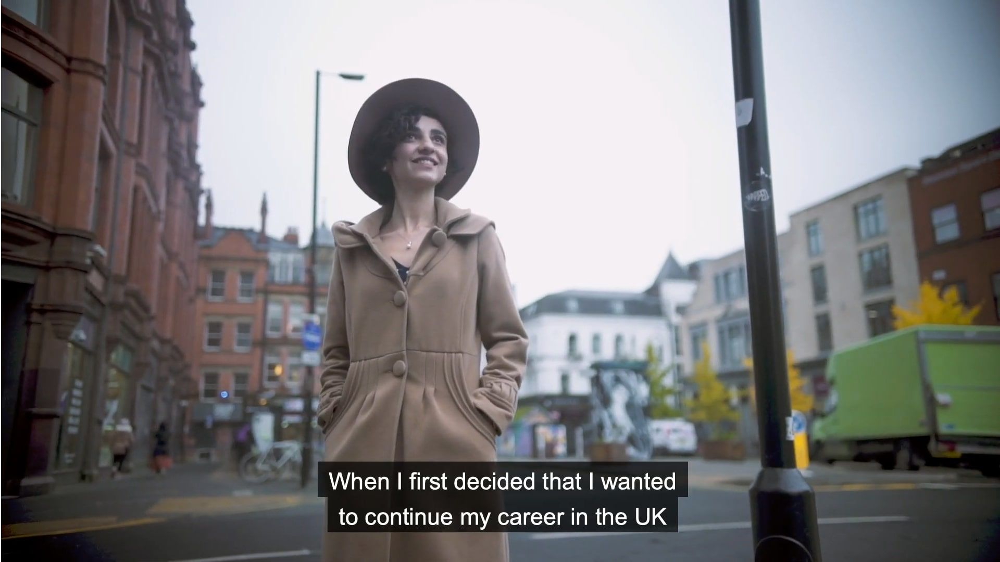

2019-da yaşadıqlarım, başıma gələnlər ağlıma gəlməyəcək qədər böyük və inandırıcı olmayacaq qədər "magical" idi. Bu postda yaşadığım maraqlı hadisələrdən 2-ni paylaşmaq istəyirəm. İlk profesional video çəklişim oldu - Mançesterdə getmiş olduğum imtahan hazırlıq mərkəzi ilə. Amma bundan daha böyükü imtahan mərkəzinin Londonda keçirdiyi ilin ən böyük OET Forumunda çıxışım olmuşdu. O gün həyatımın ən unudulmaz, ən həyəcanlı günlərindən biri idi. Elə o çıxış bu video çəkilişə gətirdi məni. Başdan başlasaq UK-də kariyerama davam edə bilməyim üçün ilk imtahanım olan OET imtahanımı ilin əvvəli vermişdim. OET- Occupational English Test deməkdir, yəni ixtisasa uyğun İngilis dili, mən də bu imtahanın həkimlər üçün olan variantına hazırlaşırdım. İmtahana çoxunluqla özüm hazırlaşmışdım, amma özüm nə qədər hazırlaşsam da, çox qorxurdum və heç özümə, İngilis dilimə inanmırdım. Mən UK-ə Bakıda heç vaxt danışmadığım İngiliscə ilə gəlmişdim, sadəcə kurslardan, filmlərdən, kitablardan öyrəndiyim ingiliscə. Bura gəldikdə isə bir müddət şok içində idim, Britaniya aksentini anlamaq çox çətin idi ilk başda və İngiliscə danışan ətrafım yox idi. Zamanla ətrafımda İngilis dilli insanlar yaratdım amma, ilk imtahanıma qədər olan zamanım kabus kimi idi, özümə inanmamaqda və hər kəsin imtahandan dəfələrlə kəsilmə hekayələrini dinləməklə daha da depresiyaya düşürdüm. İmtahanıma 1 həftə qalmış kursa yazılmaq qərarına gəldim və 1 neçə ay sərbəst hazırlaşdığım üçün, ən zəif yerlərimi bilirdim deyə o 1 həftədə tutorumla zəif olduğum yerlərimin üstündə işlədik. Amma elə ilk gündən tutorum məni çox bəyənmişdi və çox motivasiya edirdi. Əslində ətrafımda hamı mənim özümə inanmadığım dilim mövzusunda motivasiya edirdi və yaxşı danışdığımı deyirdi, lakin mən heç vaxt onlara inanmırdım və mənim xətrimə dəyməmək üçün məni motivə etdiklərini düşünürdüm. Və bu düşüncəmi tutoruma deyəndə, mənə gülüb demişdi ki, başqaları sənə yalan deyə bilər amma mənim elə ixtiyarım yoxdu, çünki mən sənin müəlliminəm və pis danışdığın halda səndə irad tutub bunu düzəltməliyik və imtahana növbəti aylarda girməlisən deməliyəm, amma mən sənin bir neçə gün sonra imtahana girməyini tam dəstəkləyirəm dedi. Bu cümləni heç unutmuram və düşünürəm ki, özümə inanma səbəbim və bəlkə də uğurlu olmağımda bu cümlə çox böyük rol oynadı.  Burdan da yeni bir həyat dərsi :) İnsanlara elədikləri işlərdə dediyimiz cümlələlər, sözlərdə çox diqqətli olmalıyıq. Sözlərin gücünə çox inanıram, çooox. 1 sözlə insanın həyatında çox şey dəyişə bilər, həm yaxşı tərəfə, həm də çox pis tərəfə..

Və imtahanda uğulu oldum, ən yüksək balı da danışıqdan almışdım, heç inanmadığım şəkildə. Ümumiyyətlə özümə o qədər inanmırdım ki, imtahanın cavabı səhər çıxdığı halda, mən cəsarət edib baxa bilmirdim, axşama qədər baxmadan dayanmışdım. Axşam özümü zorlaylb cavablara baxdığımda isə inana bilmirdim və həyatımdakı ən böyük qışqırmağımı onda eləmişdim, uşaqlığımı çıxsaq :)

Bunun üstündən aylar keçəndən sonra, tutorumdan məni konfransda çıxışa dəvət edən mail aldım. Anlamadım, mən? O boyda konfransda o boyda insanlar içində İngilis dilində danışacam? Amma həyatımda öyrəndiyim dərslərdən biri də, başından böyük olan işlərə hə demək idi. Bir iş səni nə qədər qorxudursa, o qədər səndə böyük dəyişikliklər edəcək deməkdir.  Hə dedim və detallarını soruşdum, sonra da hazırlaşmağa başladım. Amma o çıxış gününə qədər həyəcandan öldüm, mən niyə bunlara hə dedim deyib özümü yeyib bitirdim. Beynimlə bir tərəfdən bu mənə lazım deyildi, bu stresi niyə yaşayıram deyib ağlaşma qururdum, bir tərəfdən də bu çox gözəl bir şeydir, səni buna layiq biliblərsə sən buna layiqsən deyirdim. Bir tərəfdən mən konfransda danışacaq qədər İngiliscəm yoxdur deyirdim, bir tərəfdən səni dəvət edən insan sənin İngiliscənə hamıdan yaxşı bələd olan biridir deyirdim. Dəfələrlə mail yazıb vazkeçmək istəmişdim, amma bir tərəfdən o həyəcanı yaşamağı o qədər istəyirdim ki. Mən həmişə uğurlu bir insan olaraq çıxışlar etməyi xəyal etmişəm, bu xəyalımın bu qədər tez gerçəkləşəcəyini təxmin belə etməmişdim. Növbəti həyat dərsi :) Xəyallarımız bizə böyük görünür, amma kainat üçün heç nədir və qurduğumuz xəyallar bizim gerçəyimizdir hər an!

Konfrans sentyabr ayında olsa da mən 3 ay sonra haqqında yazmağa cəsarət tapmışam :)

Əslində çoox "cool" təklif almışdım, Londonda konfransda çıxış, yol xərclərim və hoteldə gecələmə xərclərim qarşılanır, əlavə olaraq çıxışım üçün də kifayət qədər yaxşı qazanc almışdım. İnana bilmirdim, bütün bunlara layiq olmaq üçün nə etmişdim ki, həqiqətən niyə seçildiyimi anlamırdım, ta ora gedib dözməyib tutorumdan soruşana qədər. Niyə məni seçdiniz dedim? O da təəccüblənmiş kimi üzümə baxıb, çünki sən ilk dəfədən imtahandan keçmisən, azınlığın içindəsən dedi. Woow o günə qədər bunun həqiqətən fərqində deyildim. Çıxışımdan sonra hər kəs yanıma gəlib suallar verirdi, necə hazırlaşdım, neynədim ki ilk dəfədən keçdim deyə. Mən etdiklərimi danışsam da, hər kəsdən fərqli heçnə etməmişdim və o qədər insan o qədər sual verirdi ki, "nəyə uğradığımı şaşırmışdım" özüm də bilmirdim səbəbini. Və sonunda sadəcə çox şanslıyam deyə bildim. Onlar bunu təvazökarlıq olaraq qəbul etsələr də, həqiqətən bu belədir. Məndən dəfələrlə yaxşı dil bilikləri olan insanlarla qarşılaşdım, amma şanssızlıqdan bir neçə dəfədən sonra imtahandan keçə bilmişdilər. Mən çox şanslı idim, səbəbi nədir bilmirəm, amma son illər özümdə inkişaf elətdirdiyim Şükür duyğuma bağlayıram bunu. Bəlkə də birilərinə gülməli gələcək bunlar, amma mən həyatın mənim üçün çox çox yaxşı planları olduğuna, şansın mənim yanımda olduğuna inanıb şansımı artırdığıma, şükür duyğumu bəsləyib Şükürlərimi artırdığıma inanıram. O gün ordakı çıxışım dəhşət idi, xatırlayanda o həyəcanı hələ də hiss edirəm, ayaqlarım əsirdi, səsim titrəyirdi, hər saniyə o səhnədən qaçıb getmək istəyirdim və danışdığım insanlar mənim üçün çox böyük insanlar idi, onların qarşısında ilk dəfə ingilis dilində çıxış etmək çox qorxulu idi, yenə olsa yenə eyni həyəcanı duyaram yəqin ki və mən o həyəcanı çox sevdim. Amma mənə verilən qarşılıq mənim özümə verdiyim kimi deyildi. Alqışları eşidəndə inana bilmirdim, çıxışdan sonra hər kəsin mənə yaxınlaşıb xoş sözlər deməyi, Cambridge Boxhill Language Assesmentin CEO-su mənə "ilk dəfə heç tanımadığın bir yerdə bu qədər böyük toplululuğa ana dilin olmayan dilində çıxışın məni çox həyəcanlandırdı və əmin ol, bugün burda elədiyin böyük bir şey idi və mən bildim ki, sənin çox böyük uğurların olacaq bu cəsarətinə" görə dedi. Məni o anda təsəvvür edə bilməzsiniz, bunun kimi möcüzəvi çox anlar yaşadım orda və Şükür duyğumun daha yüksəkdə olduğu gün olmamışdı başqa. Və tutorum mənə "sən günün ulduzusan, hər kəs səndən danışır, mənim CEO-um səni istəyir, bizimlə də bir iş görməlisən" dedi. Mən də artıq o eyforiya ilə hamıya hər şeyə hə demişdim :D Növbəti aylarda onlarla da ilk profesional video çəklişimi etdik :) Videonun linkini burda yerləşdirirəm. Uzun zaman paylaşmaqdan, aksentimdən çox utandım. Sonunda cəsarətimi topladim :)

Konfransdakı çıxışım mənim üçün çox özəldir, onu hələ ki paylaşmaq istəmirəm. Bəlkə bir gün onu da paylaşaram :)

<iframe src='https://www.youtube.com/embed//FigpiYBZa-M' frameborder='0' allowfullscreen></iframe>

