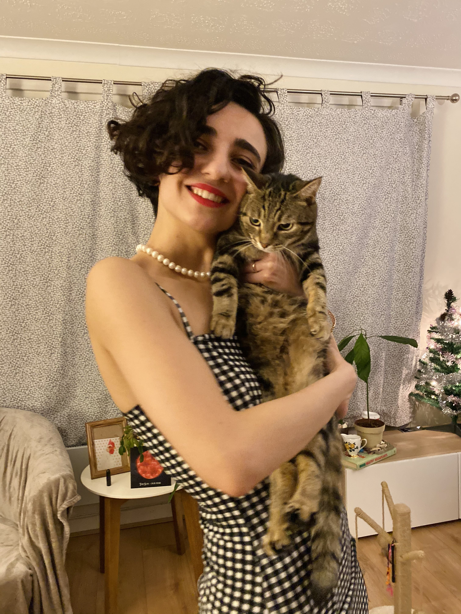
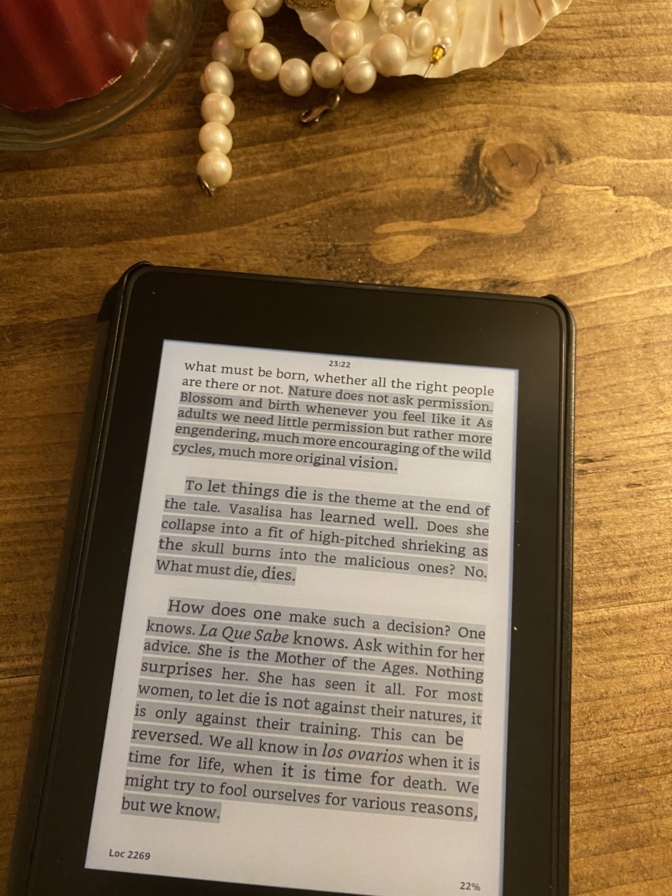
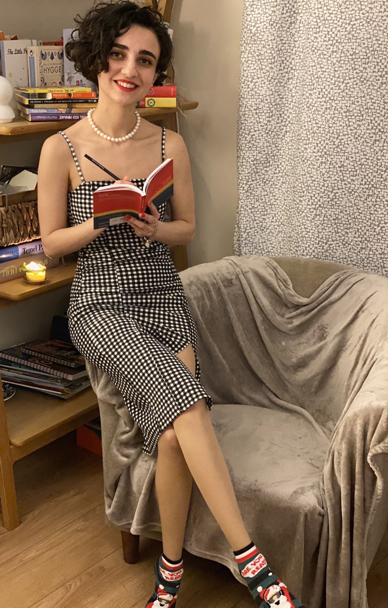
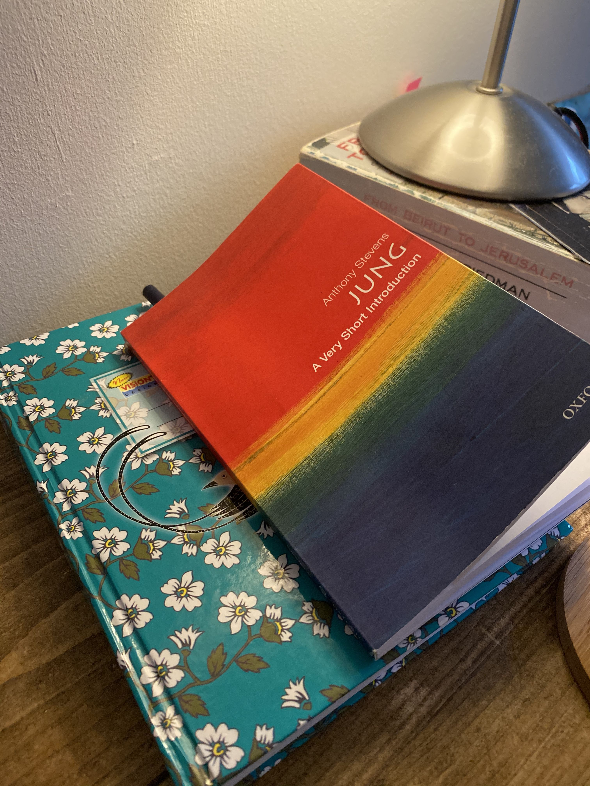
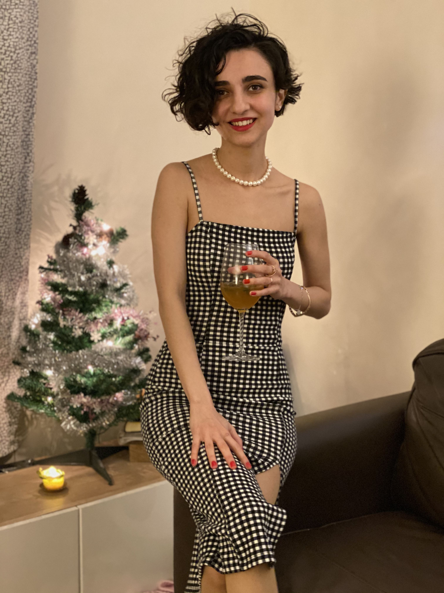
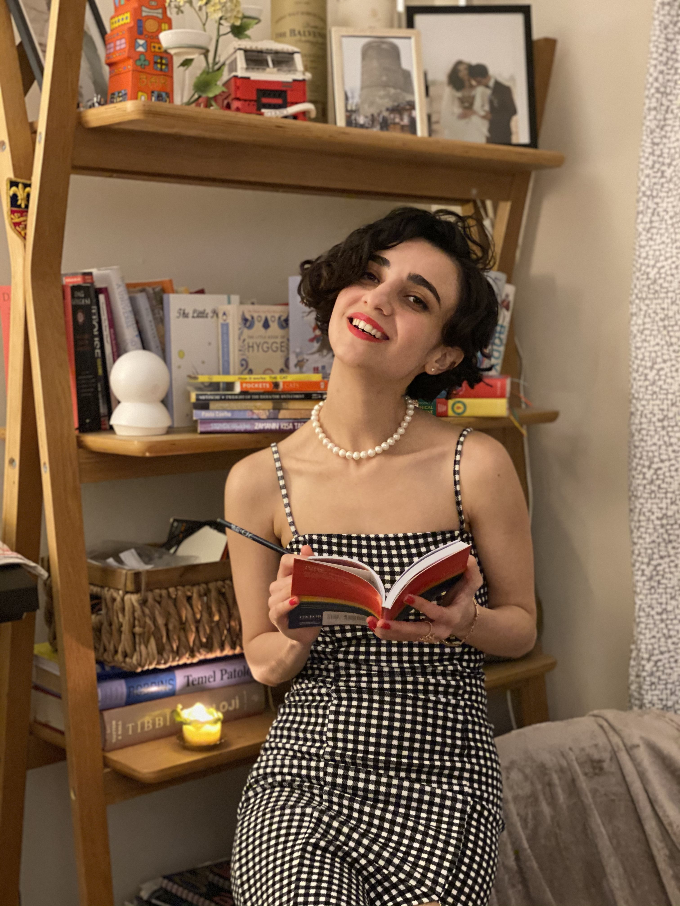

2020 has passed, which has left its mark on the lives of all of us. It has passed like all our painful, bad feelings. I got depressed a million times this year, and at the end of the day, they also passed. But this year I also learned to feel my feelings, how many feelings we have buried inside of us, although maybe if we allow ourselves to experience that feeling, it will not last more than 5-10 minutes. This year, I learned to feel the bottom of my most painful feelings, and it didn't take more than 10 minutes, a cure for a lot of things that would throw us into a lifetime and make us psychologically ill, allowing us to feel that terrible pain for just 10 minutes. This also applies to good feelings, which also come and go, and no feeling lasts forever. Although 2020 has changed many things in our lives, it has tested many of us with illnesses and the loss of loved ones, but it has also taught us all great lessons. Maybe these are lessons that we can't learn without pain, maybe it's all for us to learn more. There were so many lessons I learned this year that I accepted them all as a gift and decided to let go of my pain.

But the biggest gift for me this year was Macy.

When we took her home, her name was Macy, I didn't like the name at first, I wanted to change it, but I said to myself, "Your job is just to love her, she came with that name, why do you feel like you own it and try to change it as you want." Therefore, I did not change. But when I think of the last days of 2020, the only thing on my mind is that Macy was with us this year, she was a gift to us, how could we spend all this time without her? It was as if God knew there would be a lot of pain this year and sent us a hope. While researching the meaning of the name Macy with these thoughts, I came across the "gift of God" in Hebrew :)
And I started to experience miracles again :) This was not the only miracle I experienced, towards the end of this year, life began to send its miracles despite everything, I found myself in some areas of life, learned more in some areas, began to look at bad events differently. I found the answers to many of my questions.

Because I researched a lot, read a lot. And one of my favourite readings was, as Pincola Estes put it, "Something must die to give birth to something new." She also said that if you feel that everything is falling apart and the walls are falling down, you have two choices, either you will be crushed under those walls or you will go to the other side of the wall. Even if you feel that everything is falling apart, it is for you to cross to the other side of the wall. If that wall doesn't fall, you won't be able to move to the other side, for the better.
This was probably the year I read the most. My favourite book was Pincola Estes' “Women who Run With the Wolves”. It taught me the cycle of life and death.
 
While this book also pushed me to study Jung's Psychology, a book about Carl Jung came to me without me looking for it. It was as if I were slowly starting to align with life.

In everyone's life, something falls, something is rebuilt, when something dies, something else is reborn.
We had time to think a lot, to understand ourselves, to get on our own way, I took the opportunity to try to stay away from social networks as much as possible, I closed my Instagram account and created an environment to stay more with myself. And after 7 months, I decided to open my Instagram, but using it minimally, just following the people who inspired me and sometimes sharing my thoughts.

 On the last day of 2020, I intend to leave the pain behind,  I intend beautiful things, health, enjoying more, to learn more, to know more, to live in peace with myself, to be the best of everything for 2021. We said “Bye” to 2020 as it were one of the most beautiful years as if there was a big party at home. Got dressed and had a party by ourselves :)
Let 2021 comes and goes in the way that we all enjoy more, know ourselves more, and all the best for all of us! Like our feelings :)

