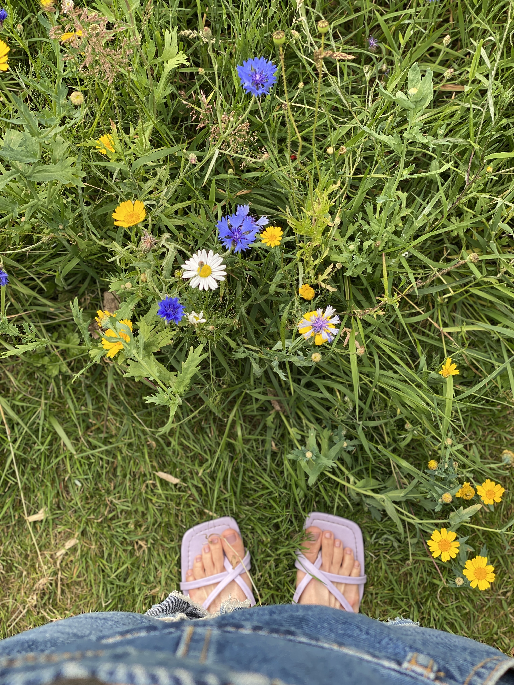
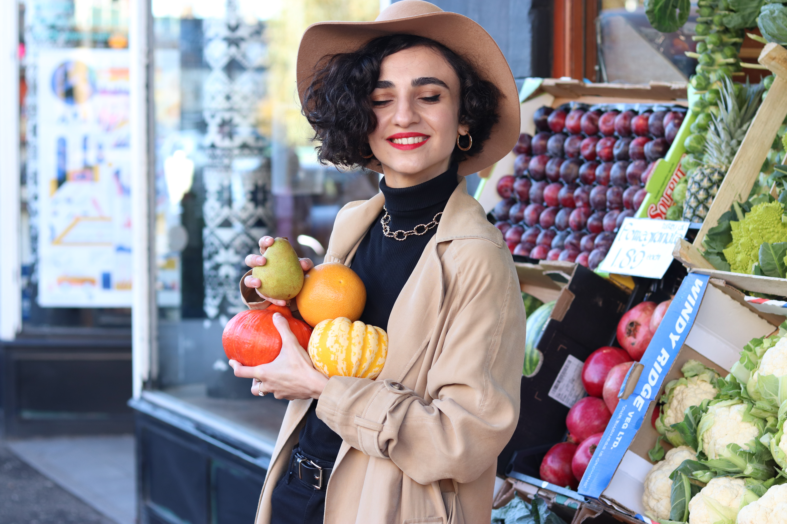
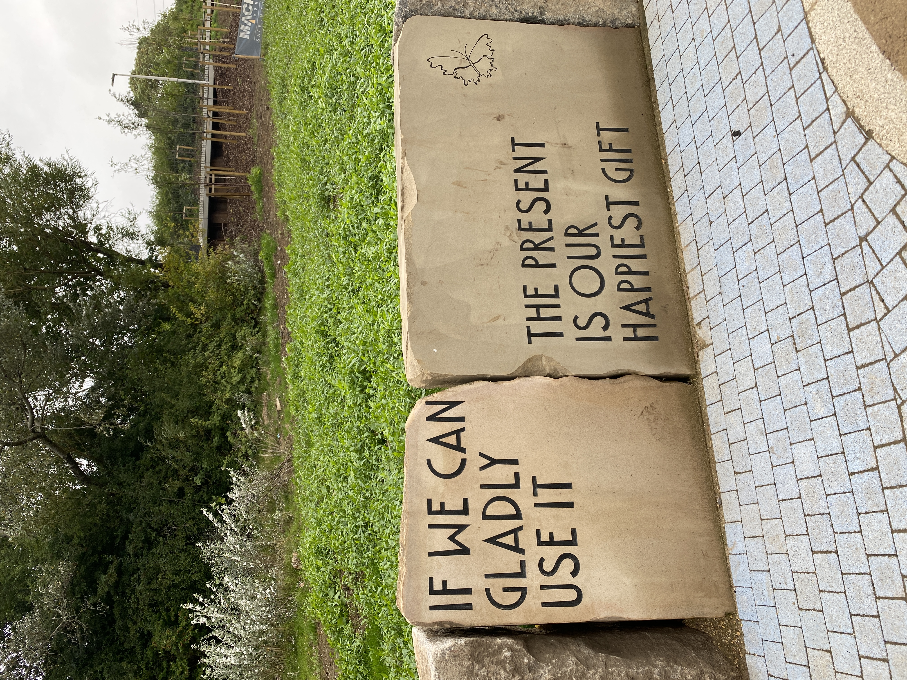
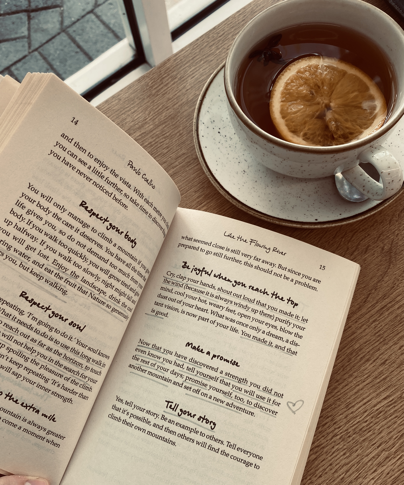
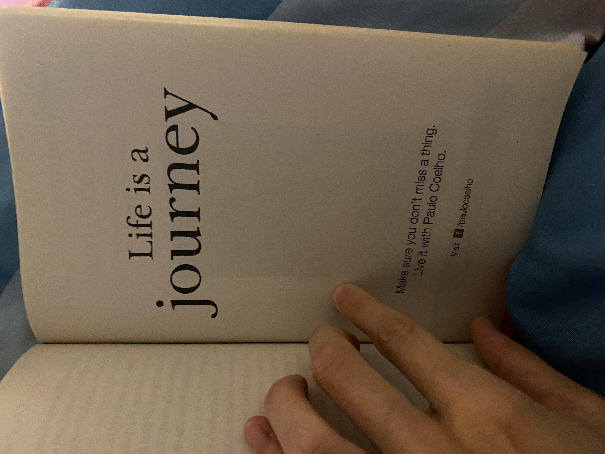
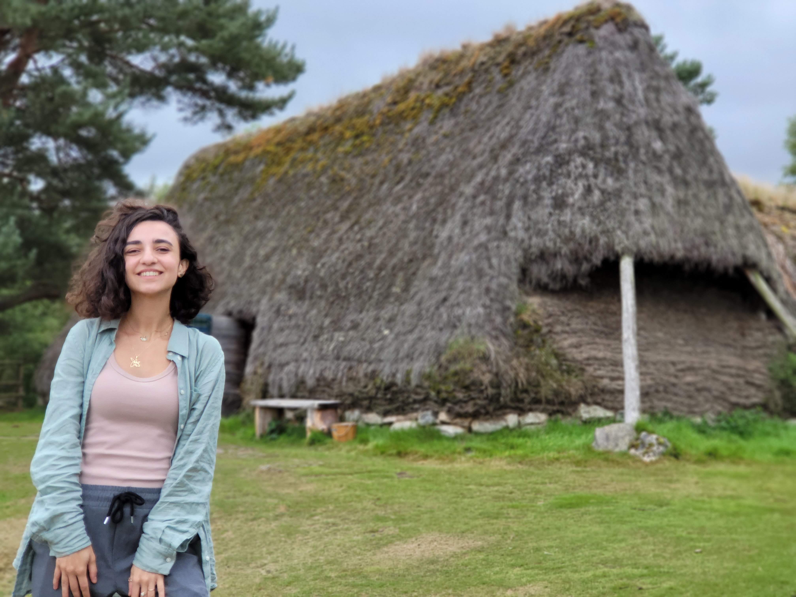
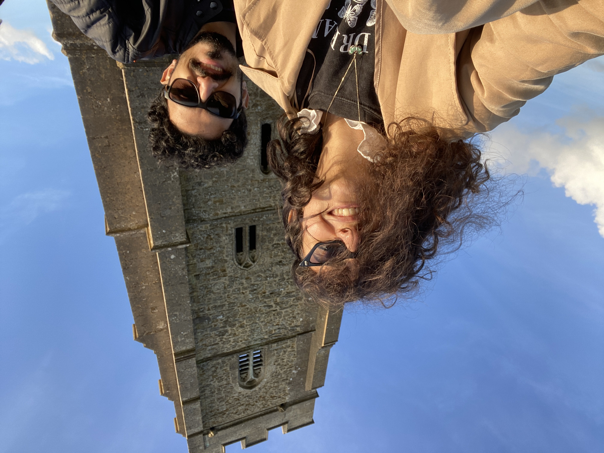
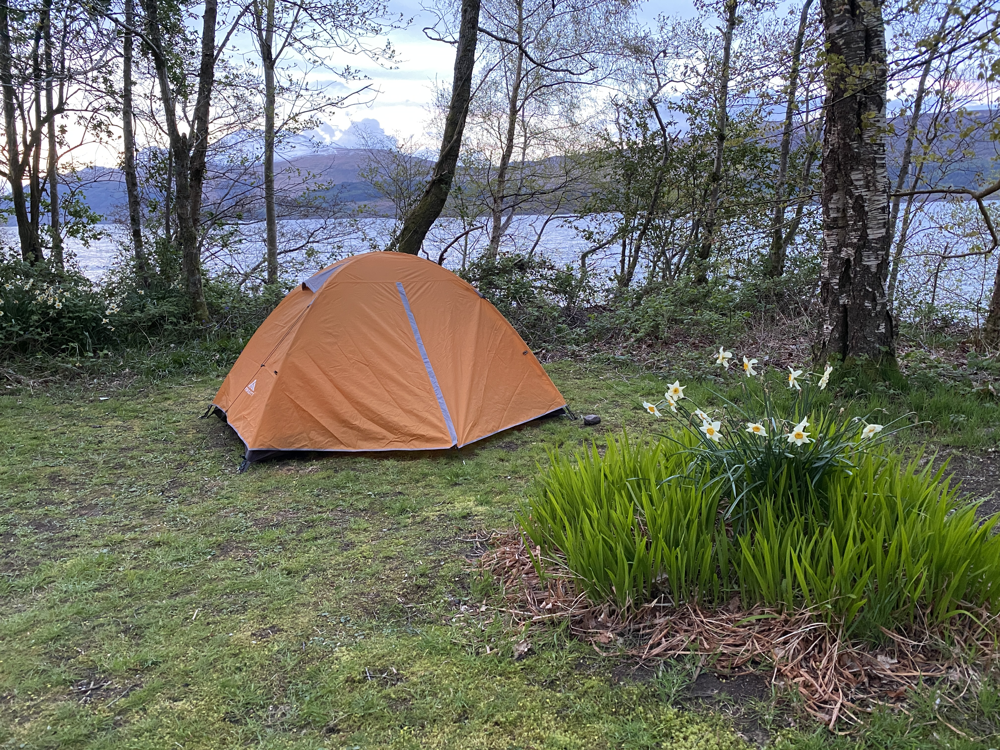
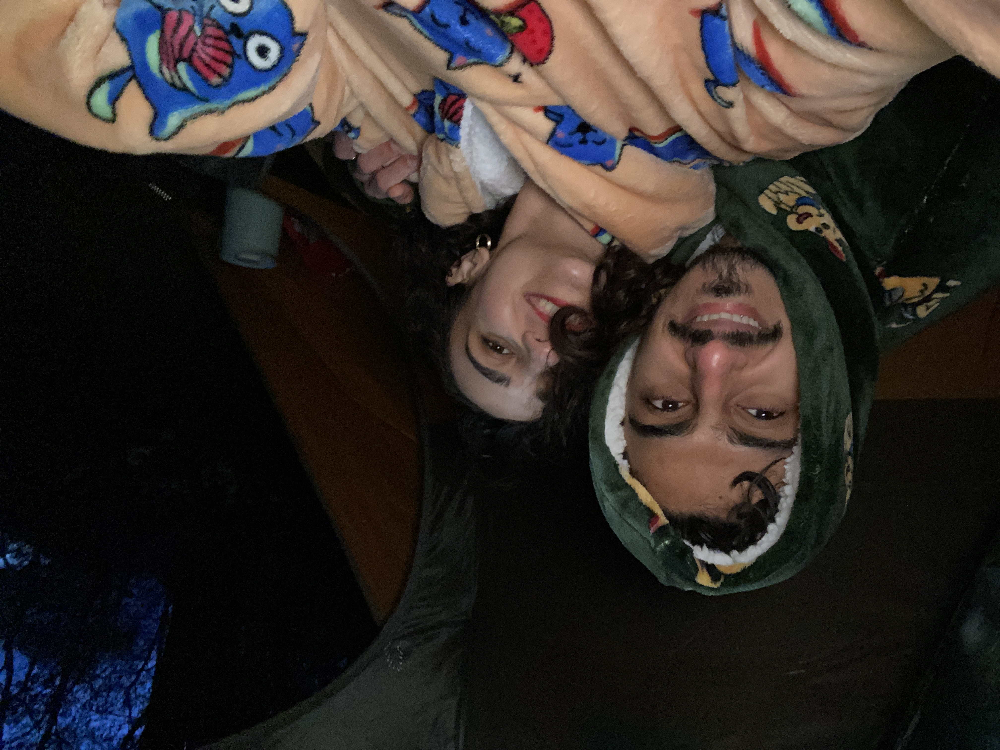
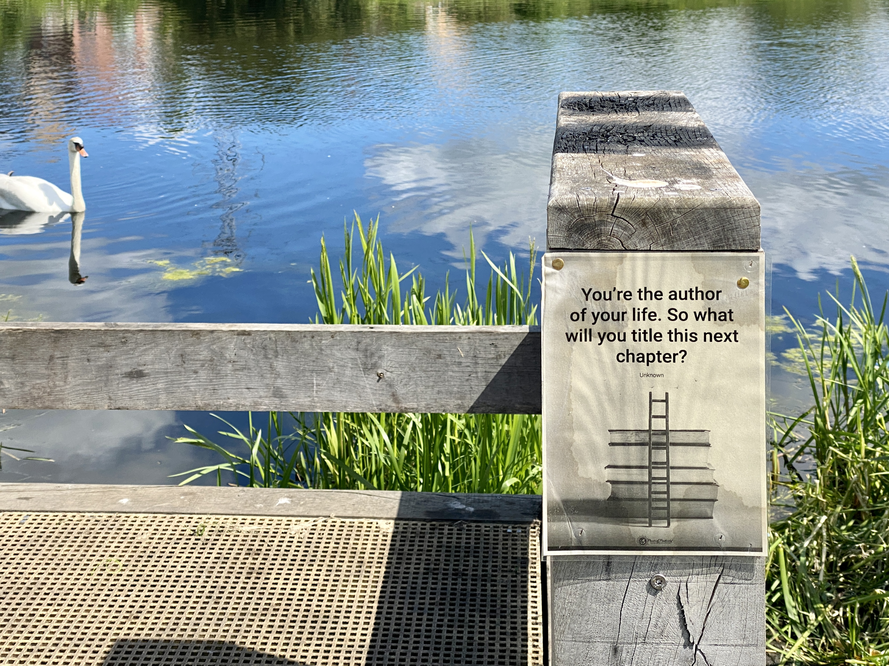

2021 həm çox böyük itkilərin, eyni zamanda qazancların ili oldu. Hər ilin öz dərsləri, öyrətdikləri var, amma bəzi illər çox böyük çətinliklərlər, böyük dərslərlə gələr. Çox gümanki kiçik çətinliklərlə o dərsi almadığımızdan həyata başqa şans vermirik bizə öyrətməsi üçün. Hər kəsin yaşadığı özünə böyükdür təbii ki, amma yaşadıqlarımızdan nə qədər dərs ala bilirik? Geriyə dönüb baxdığımızda “bu hadisənin mənə öyrətmək istədiyi nə idi?” deyə veririk sualımızı yoxsa “niyə həmişə mənim başıma gəlir bunlar?” deyirik? Yaşadıqlarımızda həmişə başqalarını günahlandırırıq yoxsa “mən nəyi fərqli edə bilərdim?” deyə düşünürük? Burada məqsəd mən səhv edtim deyib özümüzü günahlandırmaq heç deyil, məqsəd nəyi fərqli edə bilərdim ki gələn dəfə də bunu yaşamayaq düşüncəsinə gələ bilməkdir. Həyat dərsi öyrədənə qədər “dirəşəcək”. Əgər yaşanılan hadisədə lazımi dərs öyrənilməyibsə ona bənzər hadisələr yaşanmağa davam edəcək. Bəlkə məkanlar və insanlar fərqli olacaq bu dəfə...

2021 bu yazdıqlarımı xatırlatdı mənə, bu bilgiləri yenidən yenidən xatırlayıb düşünməyə, özümün və başqalarının yaşadıqlarını müşahidə edib unutduqlarımı yenidən xatırlamağa məcbur etdi məni. Bunun üçün minnət doluyam...

Mənə də çoxumuz kimi böyük dərslərlə gəldi 2021, amma bu il daha çox öz içimə çəkilib, özümü tanımağa, kəşf etməyə niyətli idim... Bunun üçün çox çalışdım, kitablar oxudum, dərslər aldım...

Oldum? :) Əlbəttə ki, yox! Hələ də eyni tipli səhvləri eləməyə davam edirəm, amma bu dəfə daha çox fərqindəyəm və daha çox niyyətliyəm öyrənməyə. Özümü daimi şagird kimi hiss edirəm, ömrümün sonuna qədər öyrənməyə davam edəcəyimə, hər zaman öyrənməyə açıq olacağıma niyyətliyəm.

Bu il yaşadıqlarım, öyrəndiklərim, yuxarıda dediyim fərqindəliklərim mənə bir çox qapıları açdı. Kariyeramla bağlı bir çox yeniliklər və gözlənilməz uğurlar gətirdi mənə. 2022-yə tamamilə yeni bir həyatla başlayacam, yeni şəhər, ev, iş, insanlar və s... Əslində 2021 də çox yeniliklər gətirdi amma onların hamısını birlikdə toplayıb 2022 tamamilə yeniliyə qapı açır...

Mən bu həyata anlardan ibarət gəlib keçən bir  kino kimi baxıram, yaşadığımız bir çox qayğının, qorxularımızın, bizi sıxan düşüncələrin, gecələr yatmağa icazə verməyən anksiyetelərimizin heç bir mənası yoxdur, günün sonunda hamımız heçnəsiz çıxıb gedəcəyik bu həyatdan. Vacib olan tək şey məncə həqiqətən yaşaya bilməkdir. Bu il oxuduğum ən gözəl kitablardan birində yazıçı Paulo Coelho təxminən belə bir şey deyirdi: “Çoxları bu həyatda ölü olaraq yaşayır, amma mən öləndə yaşayaraq öldü deyəcəklər.” Bu cümlə mənim fikirlərimlə o qədər rezonans edirdi ki, istədiyim tək şey qocalanda şikayət etmək, “ölürəm ölürəm” demək yerinə, geriyə dönüb həzzlə və həyəcanla “nə yaşadım amma bu həyatı deyə bilməkdir”. Ölüm hər zaman yanımızdadır əslində, bəzən qocalmağa da ehtiyac qalmır, ona görə də hər anımızı yaşayaraq keçirməkdən daha qiymətli heç nə yoxdur mənə görə... Ölümü hər zaman ağlımızın bir yerində saxlamaq, bizi risk almağa, daha çox həzz almağa və daha çox yaşamağa cəsarətləndirməlidir.

Hər çətinlikdə belə bizim üçün bir hədiyyə, bir dərs, bəlkə bir aydınlanma gizlidir...

Nə qədər özümüzü həyatın qollarına, yaşama ata bilirik?

2021-də həm də daha çox həyatın işarələrini izləyə bildim, sanki həyatla söhbət etdik bu il. Bir hadisə olmayacaqsa həyat mənə bir yolunu tapıb, “sakit ol, daha yaxşısı olacaq deyirdi”, elə də olurdu :) Alınmayan işlərdə ən çox sakit qala bildiyim, axışda olduğum, həyata güvəndiyim il oldu. 2022-də bunu daha çox hiss etməyə də niyyət edirəm.
P.S əsəbdən partladığım anlar da oldu əlbəttə ki :)

💡 2021-in ən sevdiyim kitabı

Paulo Coelho Like the Flowing river

💡 2021-in ən sevdiyim filmi

Rita Moreno: Just a girl who decided to go for it

💡 2021-də kəşf etdiyim ən maraqlı yerlər

Şotlandiyanın dağlıq yerləri (Scottish Highlands) Ətraflı [burdan](https://ganira.net/articles/scottish-highlands) oxuya bilərsiniz.

Glastonbury (İngiltərinin mistik şəhəri) Ətraflı [burdan](https://ganira.net/articles/the-most-mystic-city-of-2021) oxuya bilərsiniz.

💡 2021-də etdiyim ən çılğın şey

Şotlandiyanın çox huzurlu bir yerində çadır qurub, gecəni çadırda yatmaq.

Bütün gecə soyuqdan donduq :) Niyə? Bilmədiyimiz çox şey var idi, ilk dəfə idi. Amma nə oldu?Bütün gecəni yata bilmədik arada durub yuxulu-yuxulu, dona-dona ölürdük gülməkdən, sonra yenə yatmağa çalışırdıq və s. Amma öyrəndik, artıq bilirik hansı havada necə çadır qurmaq lazımdır və s. :) O həyəcan, o həzz çox gözəl idi, 2022 də daha çox çadırla macəralar yaşamağa da niyyət edək :)

💡 2022 niyyətlərim

1. Daha çox öyrənmək
2. Daha çox yaşamaq

2022 məqsədlərim mən və həyat arasında qalsın :)

Hər kəsə özünü daha çox tanıya biləcəyi, həyatla ahəng içində yaşaya biləcəyi bir il arzu edirəm!

