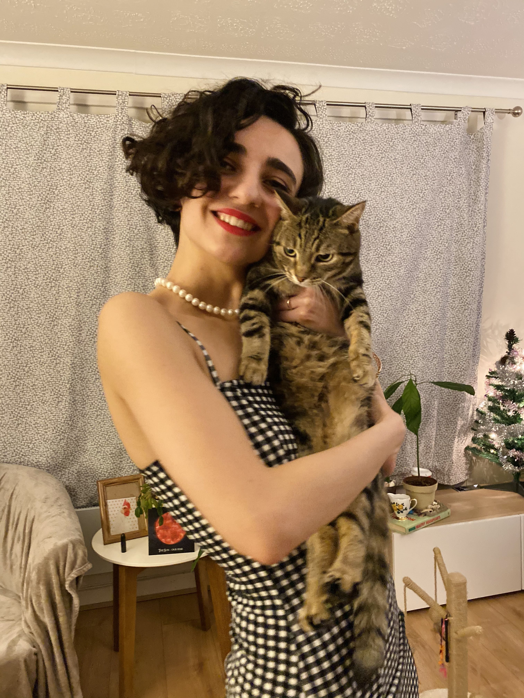
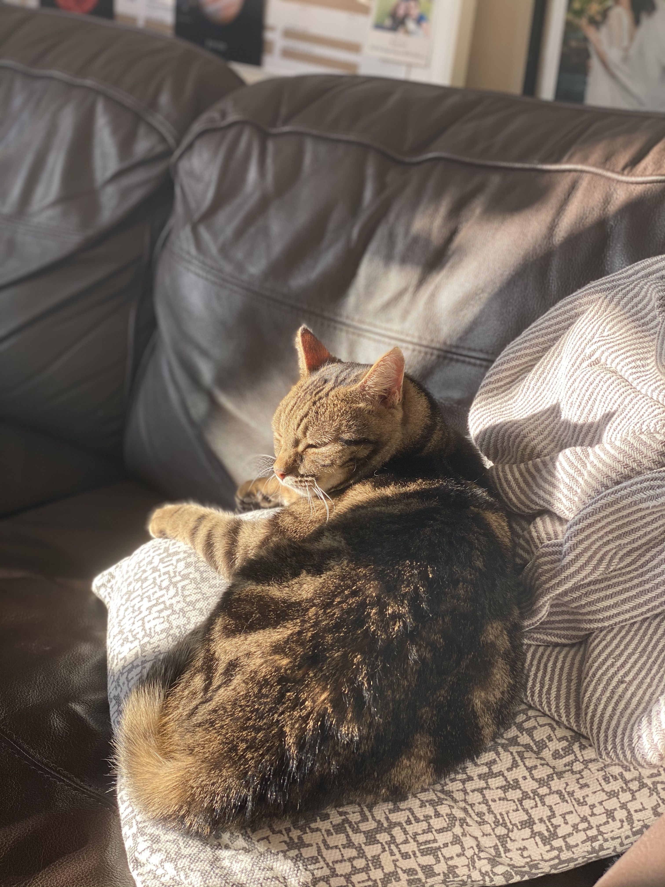
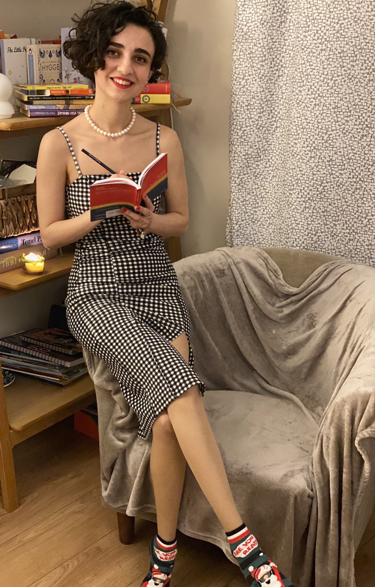
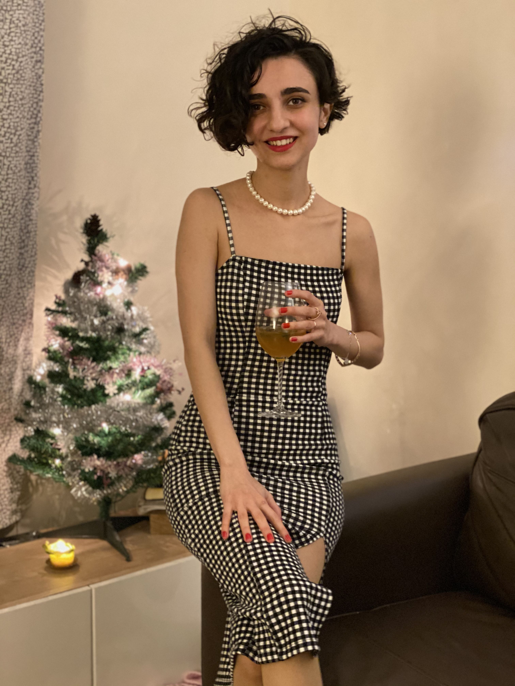

Hamımızın həyatında iz qoyan 2020 keçdi, getdi. Bütün ağrılı, pis hisslərimiz kimi, mən də bunu bu il öyrəndim :) Bu il milyon dəfə depresiyaya girdim çıxdım, günün sonunda onlar da keçdilər. Amma bu il hislərimi hiss etməyi də öyrəndim, nə çox hiss basdırırmışıq içimizdə, halbuki bəlkə də o hissi yaşamağa özümüzə icazə versək 5-10 dəqiqədən daha çox çəkməyəcək o hiss. Bu il ən acı hislərimi dibinə qədər yaşamağı öyrəndim və həqiqətən də 10 dəqiqədən çox çəkmirmiş, bir ömür içimizə atıb, özümüzü psixoloji olaraq xəstə edəcəyimiz bir çox şeyin çarəsi 10 dəqiqə o dəhşətli acını hiss eləməyə icazə imiş. Bu eyni zamanda yaxşı hislər üçün də keçərlidir, onlar da gəlirlər və keçirlər, heç bir hiss əbədi davam etmir. 2020 çoxumuzun həyatında çox şeyi dəyişdirsə də, bir çoxlarımızı xəstəliklərlə, yaxınlarımızı itirməklə sınasa da, bütün bunların altında hamımıza çox böyük dərslər də verdi. Bəlkə də bu acılarsız öyrənə bilməyəcəyimiz dərslər, bəlkə də bizim daha çox öyrənməyimiz, dərs almağımız üçün yaşandı bütün bunlar. Bu ilin mənə öyrətdiyi çoxlu sayda dərslər oldu ki, hamısını hədiyyə olaraq qəbul edib, acısını buraxmağa niyət etdim.

Amma bu ilin mənə ən böyük hədiyyəsi də "Meysi" (Macy) oldu.

Biz onu evimizə alanda adı elə Macy idi, mən ilk başda sevməmişdim adı, dəyişmək istəsəm də, özümə "sənin işin onu sadəcə sevməkdir, o bu adla gəlib, niyə özüvü onun sahibi hiss edib istədiyin kimi adını dəyişdirməyə çalışırsan" demişdim. Buna görə də dəyişmədim. Amma 2020-nin son günləri ili düşünəndə ağlımda tək şey, nə yaxşı ki, bu il Macy bizimlə oldu, hədiyyə oldu o bizə, bütün bu periodu onsuz necə keçirərdik? Sanki Tanrı bu il çox acılar olacağını bilirdi və bizə bir ümid göndərmişdi. Bu fikirlərlə Macy adının mənasını araşdıranda, qarşıma İbranicədə "Tanrının hədiyyəsi" çıxdı :)
Və yenə başlamışdım möcüzələr yaşamağa :)  Yaşadığım tək möcüzə bu deyildi, bu ilin sonlarına doğru hər şeyə rəğmən həyat öz möcüzələrini göndərməyə başladı, özümü bəzi mövzularda tapdım, bəzi mövzularda daha çox öyrəndim, pis hadisələrə artıq başqa gözlə baxmağa başladım. Bir çox sualımın cavabını tapdım.

Çünki çox araşdırdım, çox oxudum. Və oxuduqlarımın içində ən sevdiyim Pinkola Estesin dediyi, "Bir şeylər ölməlidir ki, yeni bir şeylər doğulsun" oldu. Hə bir də deyirdi ki, hər şeyin dağıldığını, divarların yıxıldığını hiss edirsinizsə, 2 seçiminiz var, ya o divarların altında qalıb əziləcəksiniz, ya da divarın o biri tərəfinə keçəcəksiniz. Əslində siz hər şeyin dağıldığını hiss etsəniz də, o dağılan şey sizin divarın o tərəfinə keçməyiniz üçündür. O divar yıxılmasa o biri tərəfə, daha yaxşısına doğru keçə bilməyəcksiz.
Bu il yəqin ki, ən çox kitab oxuduğum il oldu. Ən sevdiyim kitab da Pinkola Estesin "Canavarlarla qaçan qadınlar" kitabı oldu. Mənə yaşam və ölüm döngüsünü öyrətdi 
Bu kitab da məni Yunq Psixologiyasını araşdırmağa itən zamanda, Karl Yunqla bağlı kitab önümə öz özündən mən axtarmadan gəldi. Həyatla deyəsən artıq yavaş-yavaş başlayırdıq hizalanmağa.

Hamının həyatında bir şeylər yıxılır, bir şeylər yenidən tikilir, bir şeylər öləndə, başqa şeylər yenidən doğulur.
Çox düşünməyə, özümüzü anlamağa, öz içimizə doğru yola çıxmağa vaxtımız oldu, mən bunu fürsət bilərək sosial şəbəkələrdən də maksimum uzaqlaşmağa çalışdım, İnstagram hesabımı da bağlayıb, daha çox özümlə qalmağa şərait yaratdım özümə. Və artıq 7 aydan sonra İnstagramımı açmağa, amma minumum istifadə edib, yalnız məni ilhamlandıran insanları izləyib, ara-sıra düşüncələrimi də paylaşıb, amma çox az vaxtımı ora sərf edə biləcəyimə qərar verdim.  

2020-nin son günü, yaşadığım acıları geridə buraxmağa, 2021 üçün gözəlliklərə, sağlamlığa, əylənməyə, daha çox öyrənməyə, bilməyə, özümlə sülh içində yaşamağa, hər şeyin ən xeyirlisinə niyət edib, sanki çox gözəl illərdən biri imişcəsinə, sanki böyük bir qonaqlıq varmışcasına evdə tək olduğumuz halda geyinib-keçinib  uğurladıq ili :)
2021 hamımızın daha çox zövq aldığı, daha çox özünü tanıdığı, hamımız üçün ən xeyirlisi nədirsə o olacaq  şəkildə gəlsin və keçsin! Hisslərimiz kimi :)

