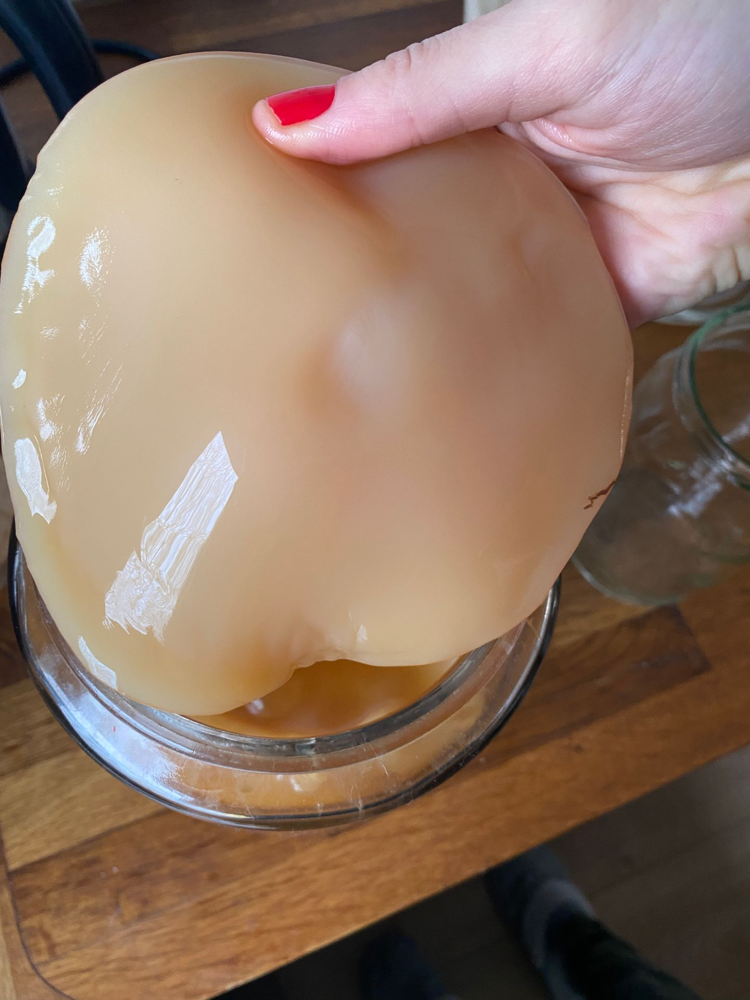
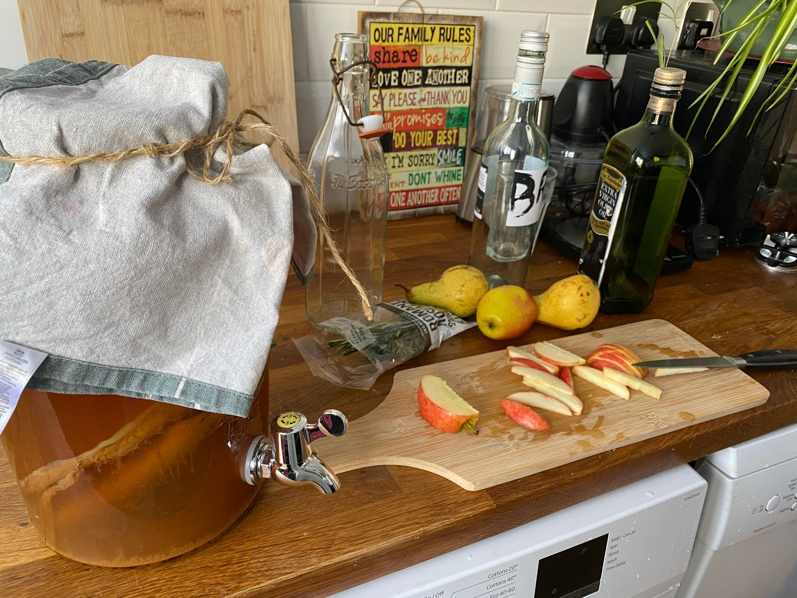
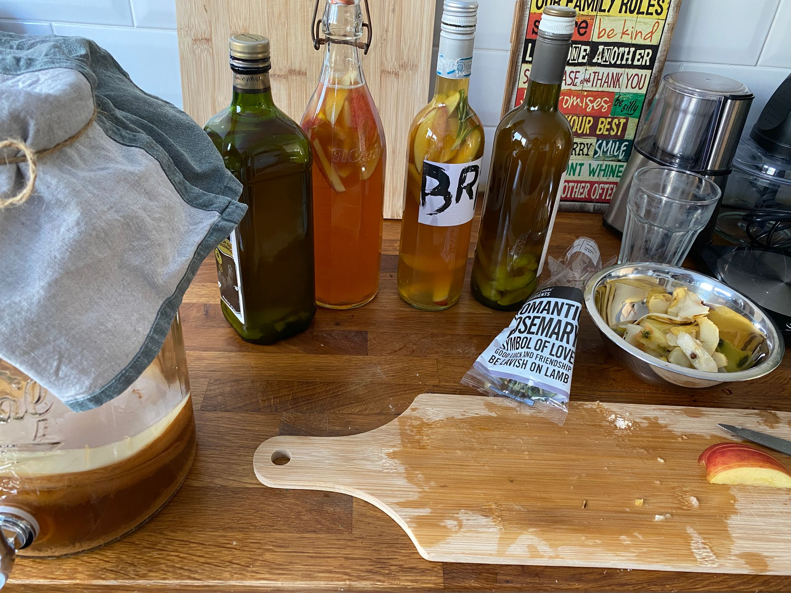
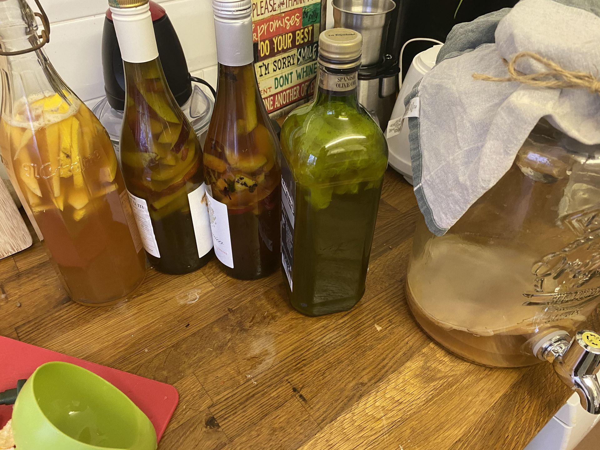
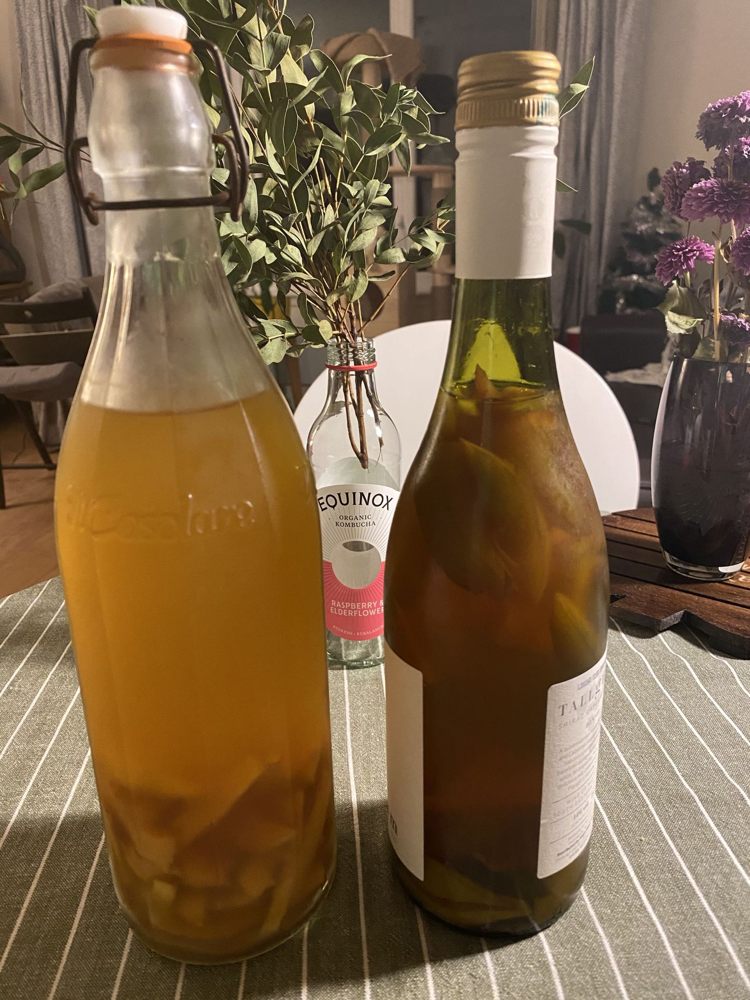

Kambuçanın nə olduğunu və faydalarını bilmirsinizsə deyərdim bu posta  bir göz gəzdirin.

[Kambuça nədir?](https://ganira.net/az/articles/kambuca-nedir)

Burda isə mən yalnızca hazırlanmasından danışacam. Kambuçanın hazırlanması əslində çox asandır, işin çətin tərəfi kambuça anasının tapılmasıdır. Buna SCOBY (symbiotic culture of bacteria and yeast)     deyilir çox yerdə, yəni ki bakteriya və göbələklərin simbioz yaşadığı bir mat. SCOBY bir dəfə tapıldıqdan sonra balalayır və sadəcə 1 neçə aya 4-5 SCOBY-niz olur. Bunun ən yaxşı yolu kambuça sevər qonşulardan, tanışlardan bala SCOBY istəməkdir. Və ya lokal kafe və restoranlarda kambuça verilirsə onlardan bala istəmək mümkündür, o da yoxdursa almaq. Anlayıram ki Azərbaycanda kambuça məşhur deyil və tapmaq çətin olacaq. Onlayn marketlərdən xaricdən almaq variantı da var. Və ya 0-dan öz kambuça SCOBY-nizi də düzəldə bilərsiniz, bunun üçün internetdə araşdıra bilərsiniz. Mənim yaşadığım ərazidə Kambuça sevərlər olduğu üçün SCOBY tapmaqda çətinlik çəkmədim, və balalarım da çoxdur, istəyən olsa mail yazın Bakıya gələndə imkan olsa gətirim :D

SCOBY-ni tapdıqdan sonra, bizə ancaq şəkər, çay və başlanğıc kambuça (starter) lazımdır. Amma çay natural, ədviyyatsız olmaıdır. Ya adi qara çay və ya yaşıl çay. Çünki müxtəlif ədviyyatlar SCOBY-nin bakteriyalarını öldürə bilir, məsələn berqamot ətirli çaylar. SCOBY isə çoxunluqla su içində gəlir, bu su elə başlanğıc kombuçadır. Məntiq bəsit halda belədir: Şirin çaya scoby-ni və başlanğıc kombuçanı atırıq, otaq temperaturlu qaranlıq yerdə 1-2 həftə fermentə olmasını gözləyirik. Və VOİLA! 1-2 (bəzən 3) həftə sonra hazırdır, bu halda da içə bilərik, amma daha dadlı və əyləncəli olmasını istəyiriksə bundan sonra "FUN PART" dadlandırma və butulkalara doldurma hissəsi gəlir :) Keçək reseptə.

Əslində burda qızıl qayda deyə bir şey yoxdur, hər şey zövqə görə dəyişir. Mən 5L-lik balona

- 12 stəkan su (6stəkan qaynar, 6 stəkan soyuq amma qaynadılmış su)

- 5-6 yemək qaşığı çay (mən yaşıl və qara çayları qarışdırıram, amma siz zövqə və ya evdə nə var ona uyğun edə bilərsiniz)

- 5-6 yemək qaşığı şəkər. Burda şəkər SCOBY-nin qidasıdır, bu qədər şəkər bizim bədənimizə getmir, onu SCOBY fermentasiya prosesi üçün istifadə edir, eyni zamanda qazlı içki olmasını da şəkərdən CO2(karbon qazının) ayrılması ilə təmin edir. Nə qədər çox şəkər o qədər qazlı olma ehtimalı olur.

- 1-2 stəkan başlanğıc kambuça. Bu nədir? Bu ən bəsit halıyla desək artıq hazır olmuş asetik kambuçadır, bu başlanğıc su nə qədər asetik olarsa o qədər tez kambuça dəmlənər.

Nə edirik? Mən əvvəlvə 6 stəkan suyu qaynadıram və şəkəri bu suda həll edirəm. Daha sonra çayı bu suda 10-15 dəqiqə dəmə qoyuram, 10-15 dəqiqə sonra çay tamamilə çıxarılmalıdır. Buna görə də ən rahatı paket çay istifadə etməkdir, amma əgər varsa evdə normal çayı "pendir parçası" kimi torbaların içində də qoya bilərik. Mən bu üsulu seçirəm. Daha sonra isə soyuq suyu əlavə edirəm bu isti şirin çaya. Çünki SCOBY-nin üstünə isti su tökə bilmərik, SCOBY canlıdır unutmayaq, onu öldürərik. Həmin o şirin çayın soyuq və ya ilıq olduğundan əmin olduqdan sonra başlanğıc çayın içindəki SCOBY-ə əlavə edirik. Üstünü isə təmiz (steril) parça ilə bağlayırıq. Çünki hava keçməlidir mütləq.

Və qoyuruq 1-2 həftə qaranlıq və otaq temperaturlu bir yerə qalır. Kombuçanın nə zaman hazır olması bir çox şeydən asılıdır. Başlanğıc kambuçanın nə qədər asetik olmasından, havanın temperaturundan, SCOBY-nin nə qədər yetkin olmasından və s. İlk başlar eksperiment olur hər şey, 1 neçə dəfə yoxlamaqla öz ideal vaxt aralığını tapırsan. Kambuça çox qaldıqca daha çox asetik, yəni sirkə dadlı olacaq. Bəzi insanlar o acı, sirkə dadını sevir və elə içir. Bəzilərisə sevmir və tez bitirir fermentasiya prosesini. Bu da zövqdən asılıdır. Təbii ki, nə qədər çox asetik dad olsa o qədər probiotiklə zəngindir, amma biz bunu dərman olaraq deyil, zövq üçün içirik çoxunluqla :) Nə edə bilərik? 5-ci gündən başlayaraq dadına baxın, nə qədər asetikdir? Hər gün yoxlayın və bir gün sizin ideal ağız dadınıza uyğun olacaq.

*Kambuçanı dəmləyəcəyimiz qab şüşə olsun. Plastik olmaz. İlk dəfə istifadədə qaynar su ilə steril etmək lazımdır.

*Unutmayaq ki, SCOBY canlıdır və bakteriya, göbələklərin birləşik simbioz yaşama şəklidir. Orada zərərli bakteriyaların yaranmasına imkan verməməliyik. Ona görə də istifadə edəcəyimiz qablar və parçalar təmiz olmalıdır. Zərərli orqanizmlərin yaranması sağlamlıq üçün çox təhlükəli ola bilər!

*Kambuça sirkəli olduğu üçün çoxunluqla o sirkə icazə vermir zərərli bakteriyaların yaranmasına. Ola biləcək şey kif göbələyinin yaranmasıdır. O da nadirdir amma mümkündür. Əgər sterilizasiya olunmayıbsa, və ya qoyulan yer çox nəmişlikdirsə yaranma ehtimalı var. İçməzdən əvvəl mütləq baxın. Suyun üzündə dumanlı ağ, bulaşıq görüntü varsa içməyin və onu tullayıb, 0-dan yeni başlayın. Və ya qoxusu və dadı sizə xoşa gəlməz hiss verirsə yenə də içməyin.

Yaxşı olar ki, 0-dan öz kambuçanızı etməzdən əvvəl marketlərdən və ya özü uzun zamandır hazırlayan insanlardan hazır kambuça alıb dadını və necə bir şey olduğunu bilməkdir. Bu zaman özümüz hazırlayacağımız kambuçanın təxminən necə olacağını bilməyimiz bizə kömək edə bilər.

Kambuçanın insanlar üzərində araşdırması olmadığı üçün çox içmək təhlükəli ola bilər. Ona görə də tövsiyə edilən miqdar gündəlik 1 stəkana kimidir. Bundan artıq olması yenə də sağlamlığa ziyan ola bilər.

Əgər kambuçanızın fermentasiyası bitibsə keçirik dadlandırmaya.

Dadlandırma zövqdən asılıdır. Kambuçanı dadlandırmadan, original kambuça olaraq da içə bilərik. Amma əgər həm daha dadlı, həm də əyləncəli olsun istəyiriksə dadlandırma çox maraqlı olacaq. Dadlandırma mərhələsi mənim üçün həmişə eksperimentdir, yeni dadları, kombinasiyaları hər fermentasiyada yoxlayıram.

<iframe src='https://www.youtube.com/embed/dpv-0lMHYow' frameborder='0' allowfullscreen></iframe>

Nə edirik? Şüşə butulkalara istədiyimiz meyvəni və ya ədviyyatı doğrayırıq, üzərini isə artıq hazır olmuş kambuça ilə doldururuq. Qapağını sıx bağlayıb, 3-5 gün yenə qaranlıq və otaq temperaturlu bir yerdə saxlayırıq. Bu zaman kambuça həm dadlanacaq həm də karbonatlaşacaq.

Təzə başlarda qazlı kambuçalarınız alınmasa qəti narahat olmayın. Zamanla o da öz-özündən alınır.

Sadəcə zamanla, səbrlə eksperiment etməyə davam etmək lazımdır ideal kambuça alınana qədər.

Mənim sevimli kambuça dadlarım, alma, armud, portağal, alma+darçın çubuğu, hər hansı meyvə+ nanə və ya rozmarın, qərənfil və s. Mən də hələ də eksperimentlərimə davam edirəm. Çuğunduru da yoxlamışam, maraqlı olur, amma hamının zövqünə görə olacağını düşünmürəm :)
Bir də tövsiyə edərdim başlamazdan əvvəl internetdə öz araşdırmalarınızı edəsiniz, digər insanların da fikirlərini ala bilər, eyni zamanda dadlandırmada nələrin yaxşı alındığını başqa insanların təcrübələrindən də öyrənə bilərsiniz. Suallarınız olsa isə şərhdə yaza bilərsiniz, növbəti postlarda suallara cavab yazmağa çalışaram.
Ümid edirəm faydalı olmuşdur! :)

