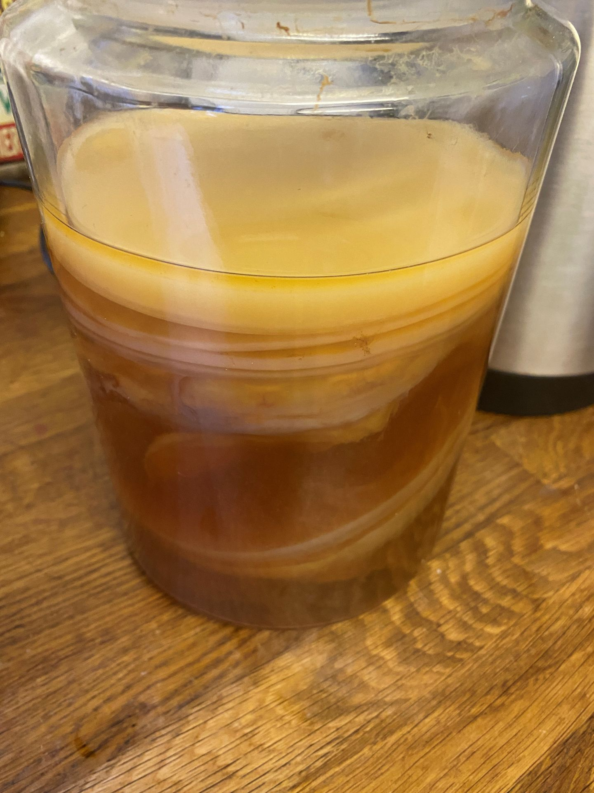
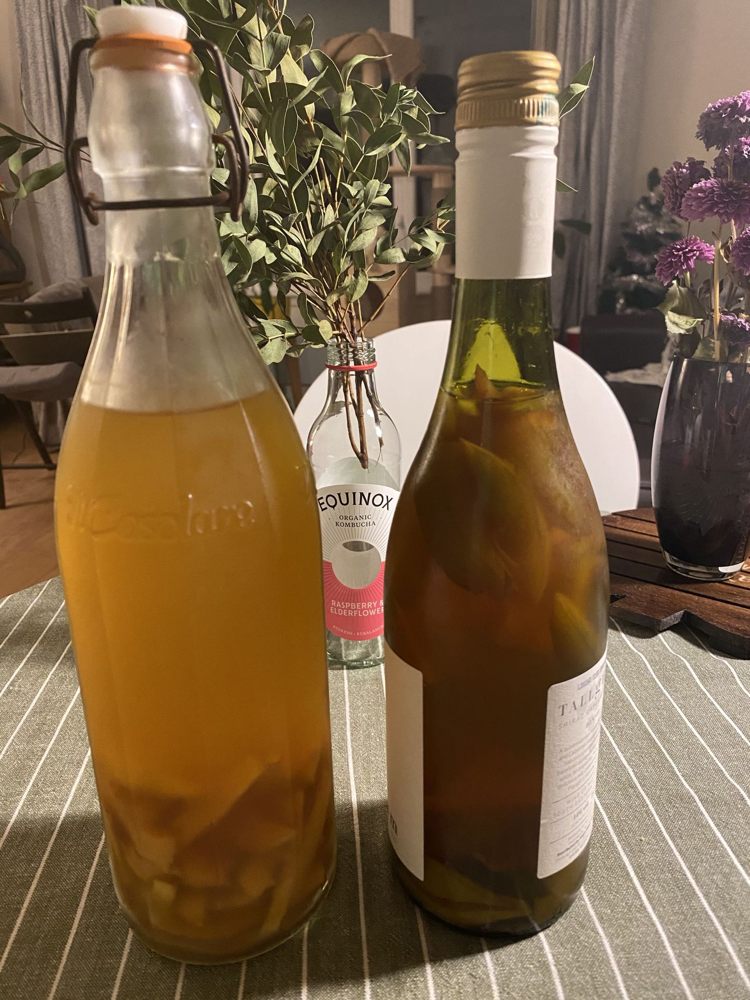
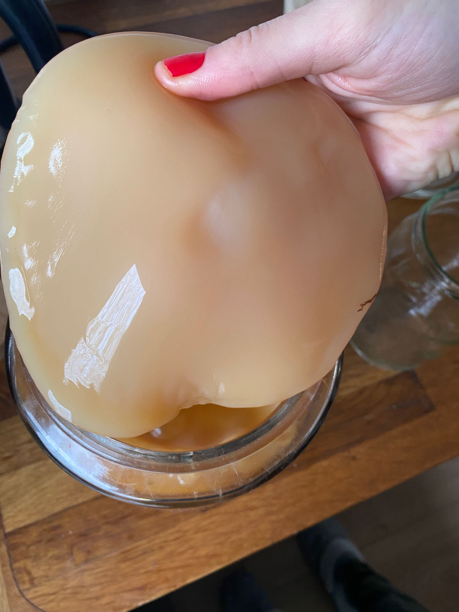

Kambuça nədir? Ən bəsit dillə desək Kambuça fermentə olunmuş çaydır. Kambu- çay göbələyi, Ça isə bildiyimiz Çaydır. Tarixi çoox qədimdir, 2000 il əvvələ qədər gedir çıxır və ilk dəfə Çində hazırlanılıb,  sonralar isə Çindən Yaponiyaya, daha sonra isə Rusiya və şərqi Avropaya yayılıb. Qərbi Avropada və Amerikada isə son illər daha da məhşurlaşıb. Bəs Kambuçanın bu qədər məhşur olmasına səbəb olan "bütün xəstəliklərin dərmanı, hətta xərçəngi belə sağaldır" cümlələri nə qədər doğrudur görəsən?

Kambuça sevər və öz kambuçamı aralıqsız özüm hazırlayan biri olaraq azca araşdırdım bu "möcüzəvi içkini" :)

Kambuça bakteriya və göbələklərdən ibarət Kambu adlı sellulozanin (kambuça anası), yaşıl və ya qara çayı fermentə etməklə, qida olaraq isə şəkər istifadə etməklə hazırlanır. Geniş və detallı necə hazırlandığını başqa postda yazacam, burda isə hələlik təxmini bir fikir yaranması üçün yazıram. Bu normal fermentasiya prosesidir, sirkələr və alkoqollu içkilər, eləcə də turş maya, kefir, qatıq, pendir, qoyulan turşular və ya bir zamanlar bizim ərazilərdə də məşhur olan Kvas da fermentasiya prosesinin nəticəsidir. Fermentə olunmuş qidalar probiotiklə zəngin olması ilə çox məşhurdur və bu elmi araşdırmalarla da təsdiqlənmişdir. Amma bu da qidanın tərkibindən və fermentasiya prosesinin özündən asılıdır. Bəs Kambuça ilə bağlı araşdırmalar bizə ne deyir?

<iframe src='https://www.youtube.com/embed//dpv-0lMHYow' frameborder='0' allowfullscreen></iframe>

Təəssüf ki, kambuçanın insanlar üzərində olunmuş tutarlı araşdırması yoxdur, yəni o verilən vədlərin elmi dayanağı yoxdur. Biz heç bir şəkildə kambuça hər hansı xəstəliyi sağaldır və ya bu xəstəlik üçün çox xeyirlidir deyə bilmərik.

O zaman kambuçanın xeyirli olması tamamilə yalandır? Burda isə şad xəbər odur ki, kambuçanın insanlar üzərində olmayan, labaratoriya araşdırmalarında tərkibi öyrənilmiş və həqiqətən də tərkibində probiotik və antioksidant olması görülmüşdür. Eyni zamanda siçanlar üzərində aparılan təcrübələr siçanlarda qan şəkərini tarazladığı, mədə yaralarına yaxşı gəldiyini, antioksidant təsirini göstərmişdir. Çayın tərkibindəki polifenol antioksidant olduğu halda, kambuça anasındakı bakteriya və göbələklərin probiotik və antibiotik təsirlərinin olduğu laboratoriya araşdırmalarında görülmüşdür. Bu araşdırmalar fermentasiya nəticəsində insanlar üçün faydalı turşular, asetil turşusu, fenollar, polifenollar, B qrup vitaminlar, fol turşusu və s. əmələ gəldiyini və bunların da antibakterial, immun sistemə stimulə edən, detoks edən, həzm sistemini stimulə edən və s. effektlər göstərmişdir. Amma bütün bu effektlərin insanlar üzərində doğruluğu bilinmir, çünki yuxarıda da dediyim kimi insanlar üzərində araşdırma yox dərəcəsindədir. İnsanlarda direkt effektini göstərəcək araşdırmalar olmasa da, digər araşdırmalardan faydalı olduğu görünür. Sadəcə dəqiq hansı dozada, nə qədər müddətdə hansı xəstəliklərdə xeyirlidir və ya qan dəyərlərini necə dəyişəcəyi məlum deyil. Günün sonunda kambuça xərçəngi sağaltmasa da, antioksidant və probiotik ehtiyacımızı ödəyə biləcək dadlı içkidir. Məncə, həm dadına, həm hazırlanma keyfinə, həm də marketlərdən alınan sodalı içkiləri əvəzlədiyinə görə istifadə edə biləcəyimiz ziyansız alternativdir.

Hazırlanmasına bolca şəkər istifadə olunmasına baxmayaraq, son içkidə şəkər miqdarı çox azdır, çünki şəkər kambuça anasının (SCOBY) qidalanmasına və parçalanmasına sərf olunur. Eyni zamanda CO2 də şəkərin parçalanmasından yaranır və kambuçaya, elə cə də bütün qazlı içkilərə o qazı verən CO2-dir. Şükür, Kimya elminə! :)

Not: Kambuçanın düzgün hazırlanması və həddini aşmadan içilməsi vacibdir. Gündə 1 stəkandan artıq içilməməlidir. Əks halda ziyanları ola bilər. Hər hansısa sağlamlıq problemi olan insanlara da içilməsi tövsiyə edilmir, insanlar üzərində araşdırması olmadığı üçün daha da ziyanlı ola bilər :)

O zaman "şərəfə" bir kambuça içək! Növbəti postumda necə hazırlandığını paylaşacam.

