Universiteti ilə tanınan bu şəhər arxitekturası, qədimi binaları, təmiz şəhər mərkəzi, qədimliyi və modernliyi özündə birləşdirən aurası ilə bizi özünə aşiq etdi. Bu şəhərdə heç nə etmədən, heç bir yerə girmədən sadəcə şəhərin küçələrini dayanmadan gəzmək belə adama bəs edir. Və elə ilk gün biz də bunu etdik. Şəhərə çatdıq və şəhəri gəzməyə başladıq. Bu qədər sevəcəyimi gözləmirdim, bəlkə də elə gözləntilərimi aşağı tutmaq buna səbəb oldu :) Oksforddan əvvəl Bath şəhərində idik, hamı o qədər tərifləyirdi ki, gözləntilərimizi yüksək tutmuşduq, bəlkə yenə də elə bu səbəbdən də o şəhəri hərkəsin bəyəndiyi qədər bəyənə bilmədik. Ona görə də getdiyimiz yerlərə artıq gözləntilərimizi aşağı tutub gedəcəyik, bu uzun səyahətimizdə bunu da öyrəndik :)

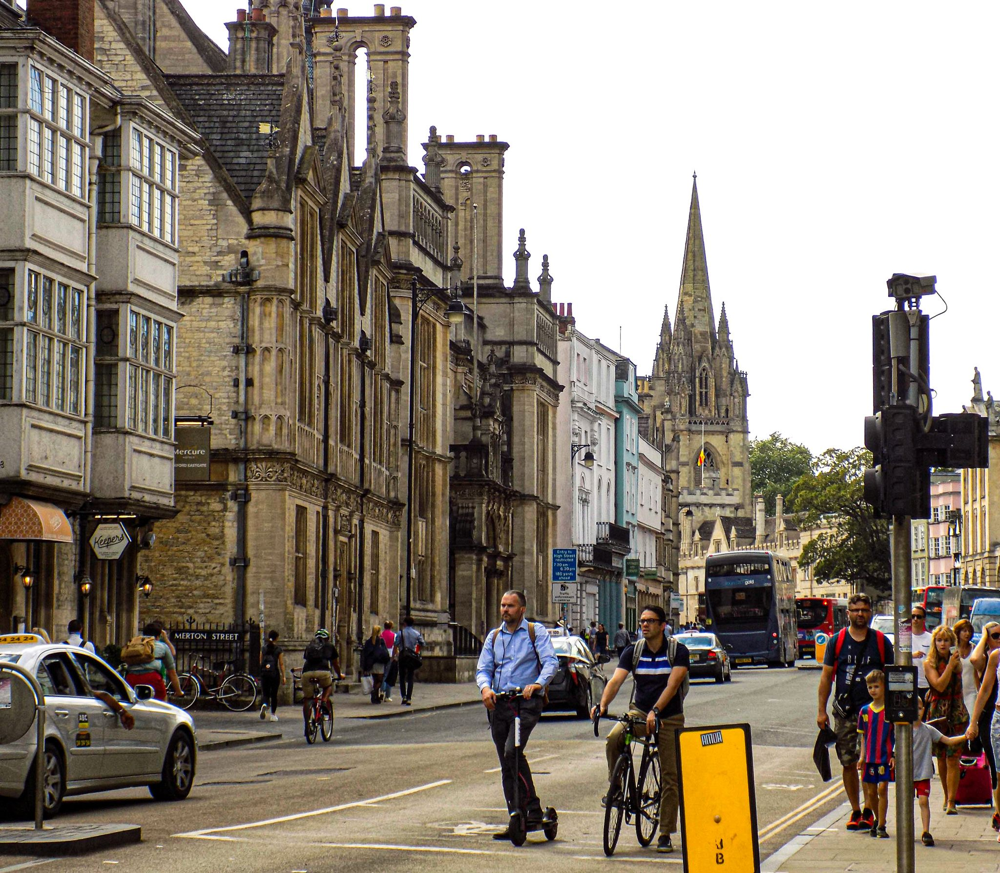

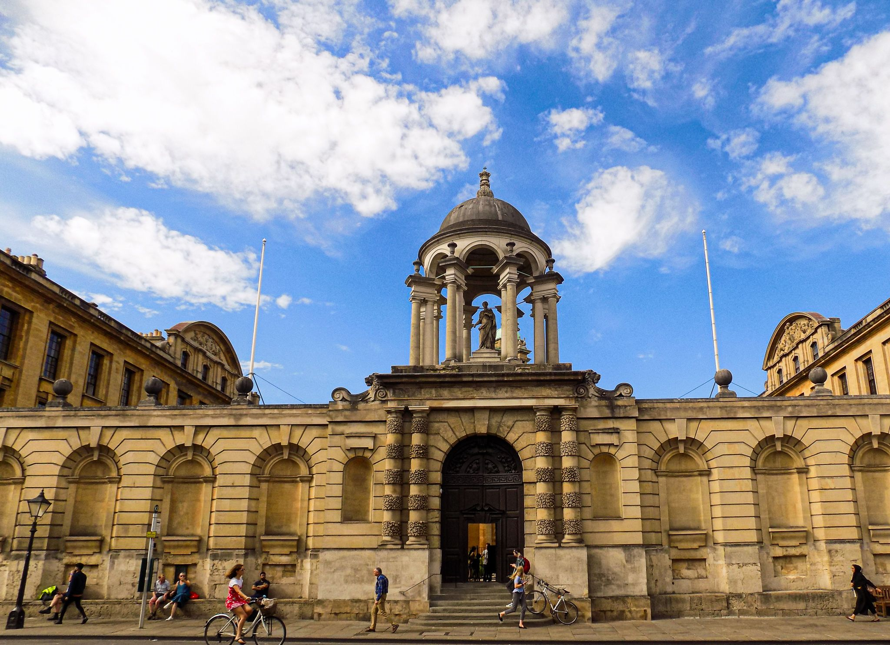

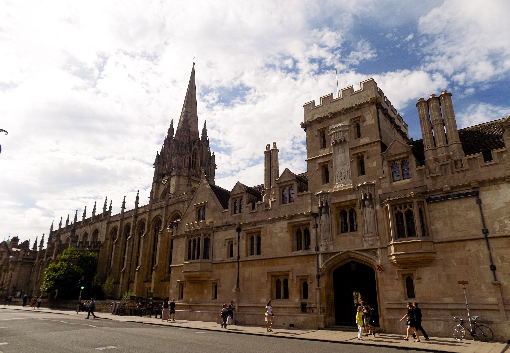

Oksford indiyə qədər gördüyüm ən təmiz və ən çox velosiped sürülən UK şəhəri idi. Bəlkə də bunun səbəbi də elə şəhərdə yaşayan insanların çoxunun elm insanı, yəni fərqindəlikli insanlar olması idi :) Mən əvvəllər buna inanmasam da, zaman keçdikcə həqiqətən də təhsilli insanların daha şüurlu yaşadıqlarına, ətrafa, dünyaya daha fərqindəlikli olduqlarına əmin oldum. Əvvəllər düşünürdüm ki, ən sadə insanın yerə zibil atmaması üçün onun təhsilli olması gərəkmir. (bu sadəcə kiçik bir misaldır) Təəssüf ki, belə deyilmiş, təhsilli insanların fərqindəliyi yüksək olur. Əlbəttə ki, istisnalar hər zaman hər yerdə var. Bunu artıq şəhər nümunələrində də gördüm. UK-də təmiz, ətrafda zir-zibil toplantısı olmayan şəhərlər tapmaq çox çətindir həqiqətən. Amma Oksford məni bu mənada təəccübləndirə bildi. Birdə şəhərdə inanılmaz çox velosiped var idi, mən buna təəccüblənəndə Nicat dedi ki, tələbələr çoxdur deyə onlardır sürən :) Amma baxdıq ki, nə qədər yaşlı insan velosiped sürürdü.  Yaşlı, gənc, tələbə olmasından asılı olmayaraq hər kəs bir birinə təsir edə bilir və bu təsirin müsbət yöndə olması nə qədər sevindiricidir :)

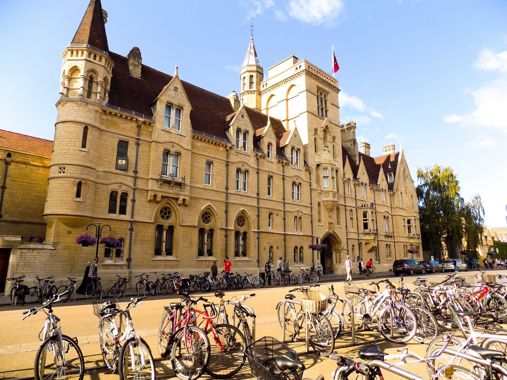

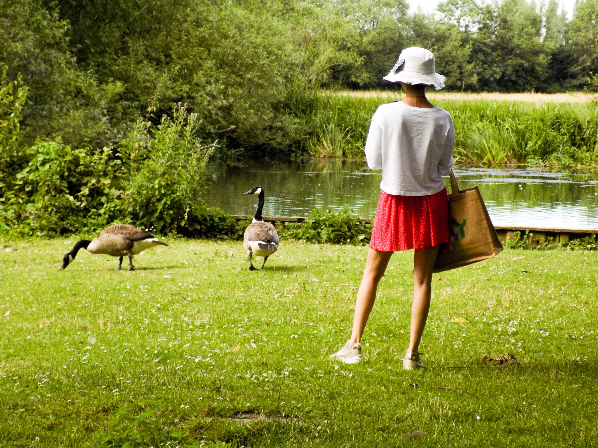

Bu şəhərə gedəcəksinizsə ilk gün heç hara girmədən şəhər küçələrini gəzin, binalara heyranlıqla, doya-doya baxın (bunlara universitet və kollec binaları, kilsələr, muzeylər, kitabxanalar və daha bir çox binalar aiddir), şəhərdəki o canlı auranı hiss edin, qarşınıza çıxan lavandaların ətirlərini içinizə çəkin, bəzən çıxsa kitab mağazalarına və ya qədimi əşyalar satılan mağazalara da girin deyərdim. Kitab mağazalarının birində Azərbaycan xalçaları haqqında kitabın qarşıma çıxması məni təəccübləndirmişdi, xalqının çoxusunun Azərbaycan adlı yeri tanımayan bir ölkədə belə kitaba rastlamaq maraqlı və gözlənilməz idi :) Biraz mərkəzdən kənarlaşacaqsınızsa da Oksfordun təbiətinin dadını çıxarın. Meşəsi, çayı, su quşları və s. :)

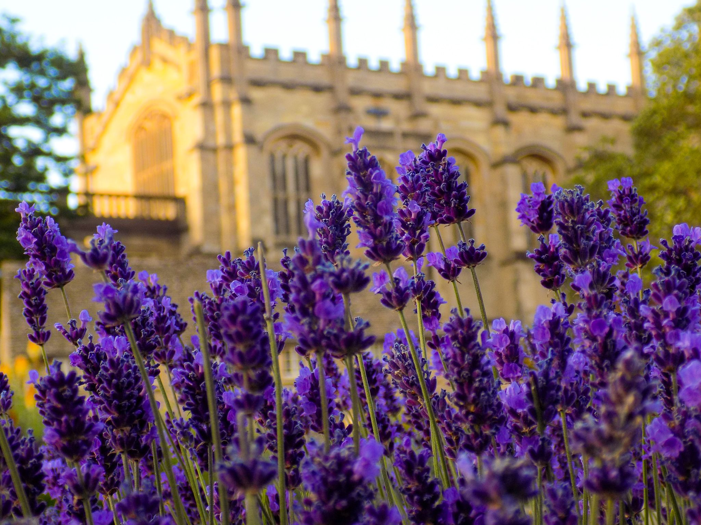

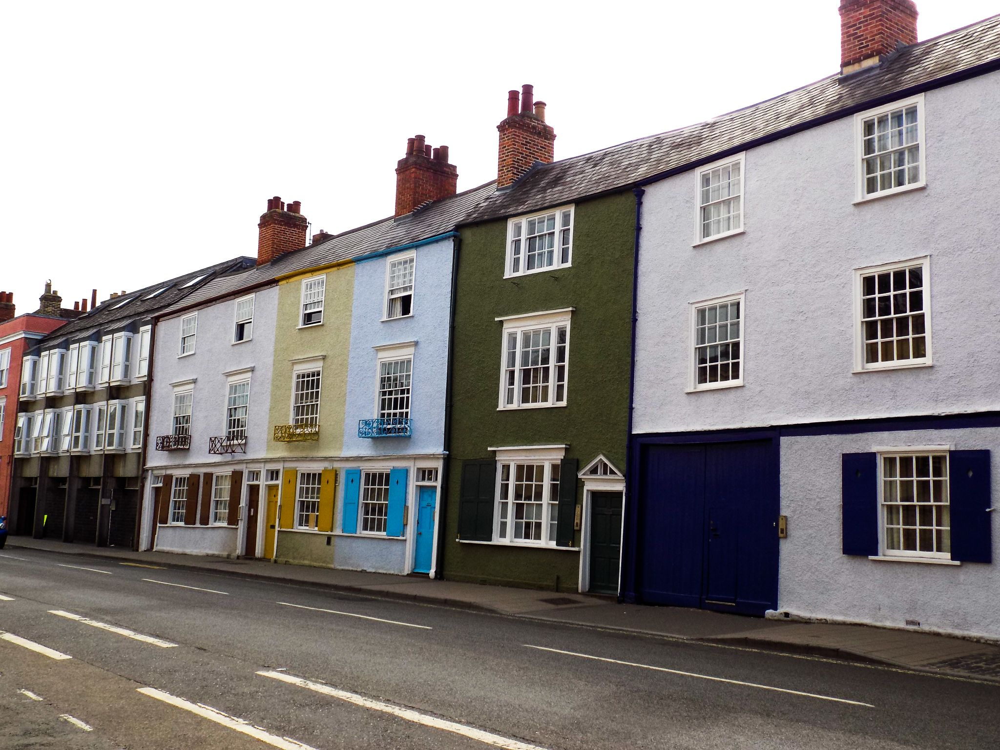

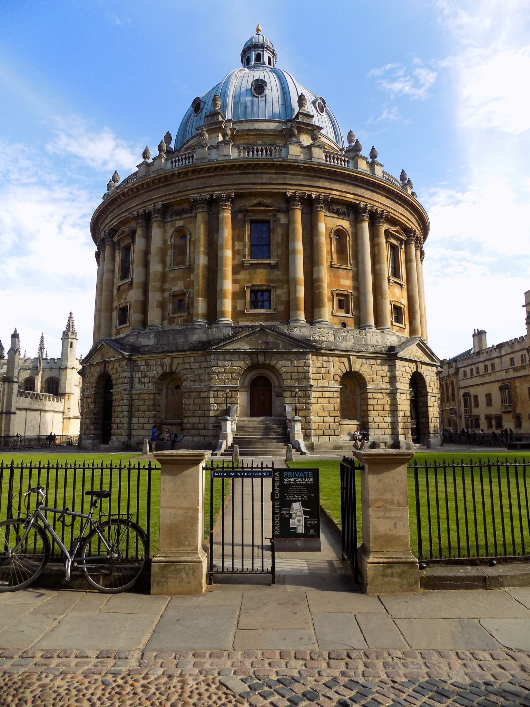

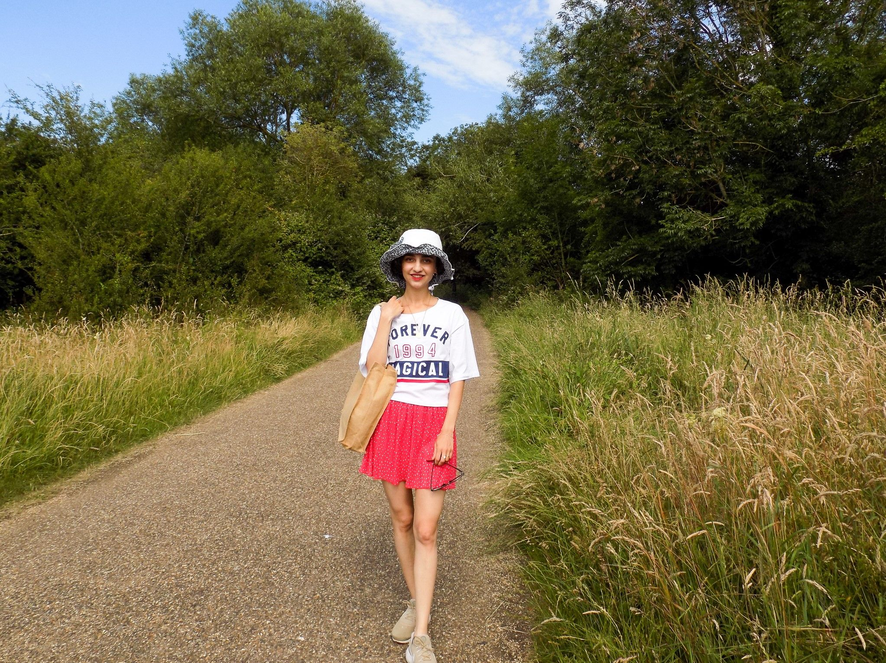

Axşam isə gəlin Oksfordun ən məşhur pub-larından biri olan Turf Tavern-də yeməyinizi yeyin :) Hava da gözəldirsə pub-ın həyətində yemeyinizdən və bu gözəl şəhəri gəzməyin verdiyi xoşbəxt yorğunluqdan həzz alın. Həmçinin bu şəhərdə maraqlı, qəşəng kafelər, restoranlar çoxdur, insan hansına girsin qərar verə bilmir.

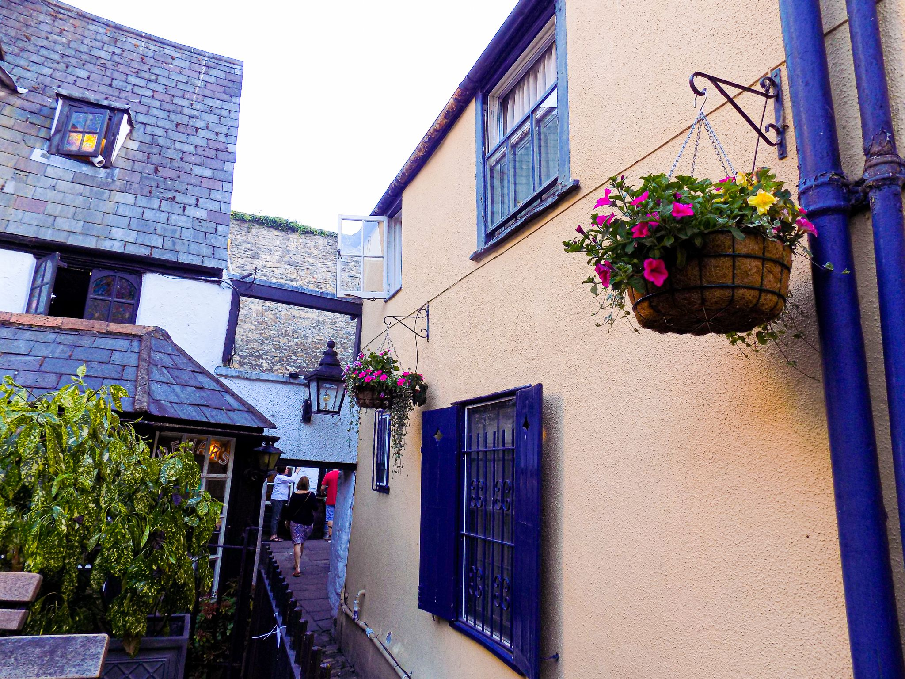

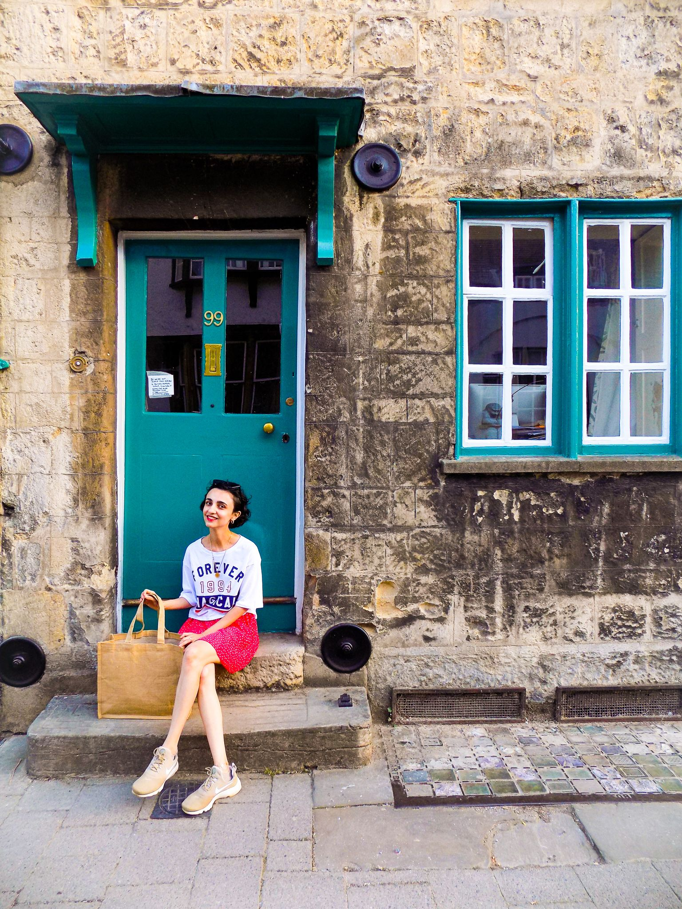

2-ci gün isə artıq muzey, kilsə, botanika bağı kimi yerlərə gedə bilərsiniz. Hər yer biri-birinə yaxındır deyə rahat gəzilir. Amma muzeylər böyük və maraqlı olduğuna görə, keyfini çıxararaq, öyrənərək gəzə bilmək üçün çoxlu vaxta ehtiyac duyulur. Bizim vaxtımız az olduğundan bütün muzeylərə girməsək də ən məşhur və bizə ən maraqlı olanlara girə bildik. İlk girdiyimiz muzey "Museum of Natural History" idi. Həqiqətən çox gözəl muzey idi. Təbiət tarixi muzeyi kimi tərcümə edilir məncə və təbiətdə keçmişdə və günümüzdə mövcud olmuş heyvanlar, bitkilər haqqında maraqlı məlumatlar ala biləcəyimiz, həm də onları görə biləciyimiz bir muzeydir. Daha sonra isə elə bu muzeyə bitişik olan Pitt Rivers muzeyinə girdik. Bu isə daha çox müxtəlif xalqların incəsənət nümunələri, onların arxeoloji və antropoloji kolleksiyalarını nümayiş edən muzey idi. Burdan da çox həzz aldıq. Bu muzeylər Oksford universitetinə bağlı olan muzeylər idi.

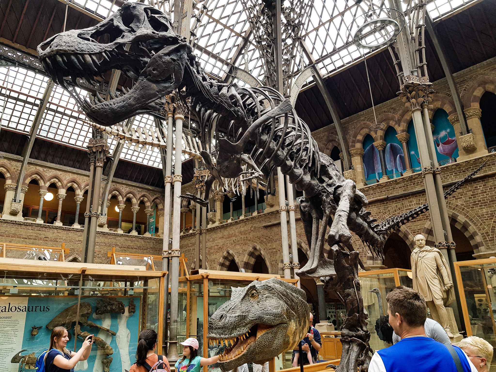

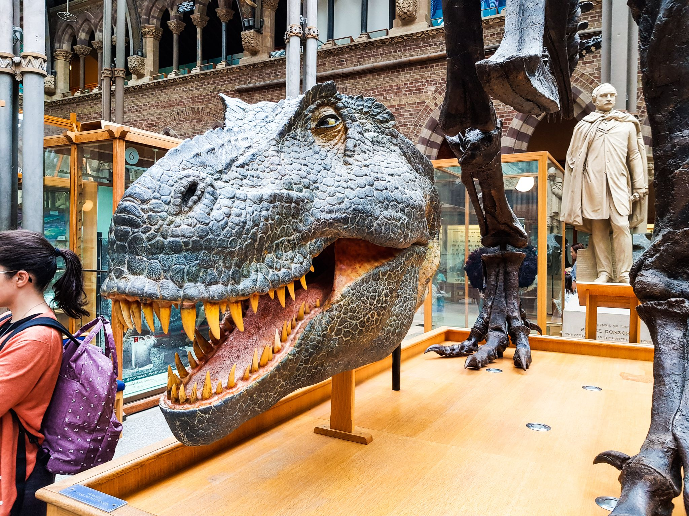

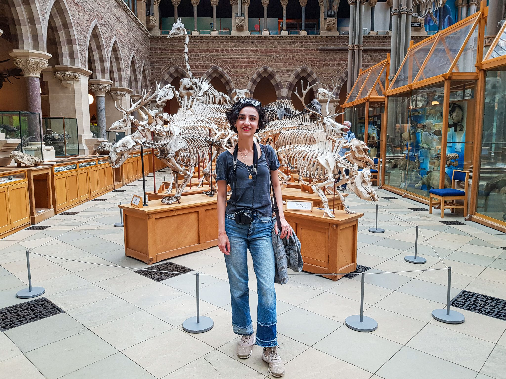

Qalan zamanımızda isə Ashmolean muzeyinə getdik. Bu muzeydə isə daha çox heykəllər və rəsm əsərləri olduğu üçün daha az maraqlı idi bizə, həm də vaxtımız az olduğu üçün az gəzib çıxdıq. Ən qəşəng tərəf isə bu muzeylər tamamilə pulsuzdur. Bircə Botanika bağına giriş pullu idi, o da bizim Glasgow-da çox böyük və gözəl, bizə yaxın, pulsuz Botanika bağı olduğu üçün Oksfordda oranı da gəzməyə ehtiyac duymadıq.

Nəticədə yenə olsa yenə gedərəm bu şəhərə, yenə eyni küçələri heyranlıqla gəzərəm, eyni muzeylərə girərərəm :) Və ümid edirəm ki, yenə gedəcəm :)
