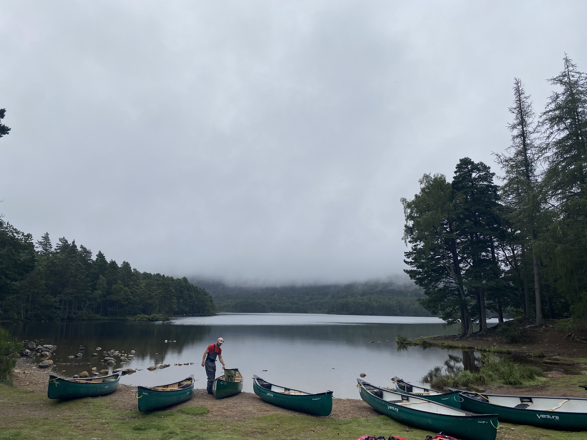
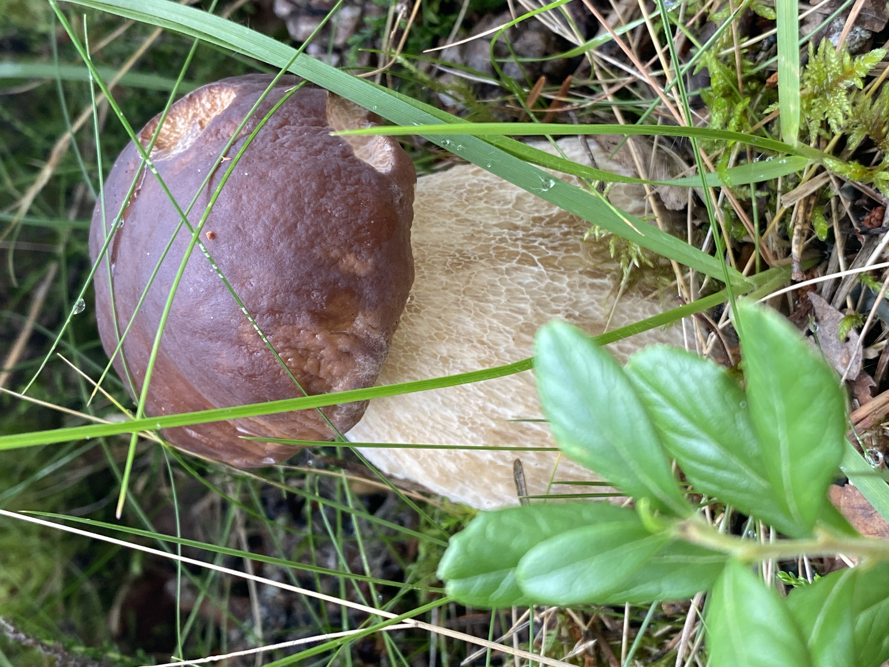

If you haven't been to Highlands, you can't say you have been to Scotland :) So keeping this in mind, we took a few days to go to Scottish highlands in this summer, this time we decided to do fun things as well, not only hiking.

So we head to Aviemore, which is a town in the Cairngorms National Park, in the Scottish Highlands. It is a town of lots of amazing Lochs, forests, wildlife etc. Even wild cats live there, but unfortunately, we couldn't see one. But sadly I came to know these Scottish wild cats are on the red list and only 100-300 cats live. So they are pretty small in numbers and in danger of oozing away.

The first day we booked canoeing in advance, so we left home early in the morning to catch the canoe at 10 am :) It was a super exciting experience in Loch an Eilein. We had canoeing in Bali, Indonesia 3 years ago. But I have already forgotten the experience. This is the main reason I am trying to write a blog post about my travels, I don't want to forget about them.
First of all, I should say the view was stunning, and imagine canoeing in this view. Even though my arms hurt a lot, but it was worth it and I would do it again. It is a good exercise as well, and you are having lots of fun :) We played a few games in the Loch and it made the experience even more fun. I would highly recommend this experience in the Loch an Eilein, our instructor was also very nice.

Let me talk about a little Loch An Eilein, it means loch of the island. In the middle of the Loch, you will see a small island with a ruined castle. Very small known about this small castle, but it is believed to origin back in the 14th century. It has its history, but unfortunately, I am very bad at history :) Long story short, you should see this beautiful Loch in the forest of Rothiemurchus.

After canoeing, we decided just to walk in the Rothiemurchus forest. I have hiked before lots of times, but it was the first time that I was seeing this many mushrooms. They were everywhere and in different sizes, colours, shapes etc.

 After a little walk, I realized, among those lots of mushrooms we didn't see a red-white toadstool one like in fairytales :) Now I have a small story to tell, that every time when I remember that moment my heart fills with joy and I smile :) So at one point, I told my husband, I want to see a red-white toadstool and we started to hunt one. And what happened? We couldn't find one until unless it was late and we headed back to our place. On our way back, I found one :) It was a different experience. How on earth you can't find one in lots of mushrooms, and you will find it after your intention and at the point, you almost lost your hope? Was it the way of the universe telling me: "sooner or later your intentions going to be real, just be patient and never give up"? Or am I too romanticizing this? Doesn't matter, I accept it as a beautiful small message. And I am grateful for this.

This read-white toadstool is called fly agaric and there are lots of myths and fairytales about this particular mushroom. We all know this from childhood fairytales or cartoons. It made me feel like I am in the middle of some beautiful fairytale and here everything is beautiful, and there is no sadness or bad things :) oh, no worries I came back to reality very very soon, but it was nice to feel like in dreams even for just a few seconds :)
At the end of the day, we head back to our little and beautiful Hotel, had dinner and spent lots of fun time together. Cause we were drunk 😄

## Second day

For the second day, we had booked quad biking in the Rothiemurchus forest. God, it was so good! I have to confess It was very scary at the beginning, I was shaking and thinking of giving up. But it could be a shame, huh? :D I am glad that I didn't give up, really. After just 5-6 mins all the fear cleared away and I just started to enjoy every second of it. Releasing adrenalin in such a view was irreplaceable. And yeah another life lesson: DO IT SCARY and you will enjoy it at one point!

Life is just this, nothing else.

 What's more? There were lots of cattle in our way :) Oh, let's talk about these cattles. They are called Highland cattle and yes breed in Scotland!

After this cool experience, we head to Glenmore lake :) But before the Loch, we saw the Reindeer centre and gave it a try. Tickets for this centre are 2 types. A cheap one is only looking 3-4 reindeers which are in the centre and you can see them any time, 2nd one is an expensive one, with this ticket you can also do 30 mins trip to the hills and you can see the reindeer hopefully cathing on the hill :) We just booked a cheaper one and watched 3-4 reindeers, but there are also lots of information about reindeers and wild life of Scotland which were interesting to read and learn about them.

I won't write much about Glenmore lake. Let the photos speak :)

I really enjoyed my time there. That view, those ducks, playing dogs and children. They all made my day.

Dinner in the La Taverna, Italian restaurant, delicious pizzas and interiors. And the hotel, finishing the day with the desperate housewives :)

# 3rd day

It was time to go back home, Glasgow. But before leaving this beautiful place we wanted to see something more for a few hours. And what happened? The most beautiful thing which was close to where we stayed, we haven't been there. How is it possible? It was the Newtonmore town and Highland Folk Museum. Newtonmore is a small and cute town, with lots of wild cat sculptures. You already know I am fond of cats :) There was a wild cat centre as well :) You can hunt wild cat sculptures there, so it was mostly for children. Even if you just walk in the Newtonmore streets, it will be worth it.

 But try to take time to see Highland Folk Museum, especially if you are an Outlander fan. This museum is the first outdoor museum in the UK. You need to take a few hours to make most of this museum. There were lots of architecture, houses, schools, workplaces etc that represent ancient highlander life. Also, there was a little town in which some of the Outlander scenes had been shot. You can also enjoy with ponies and cattles. Oh yes and if you are lucky, say hello to the hare :)

<iframe src='https://www.youtube.com/embed/y4hAuXXIHko' frameborder='0' allowfullscreen></iframe>

