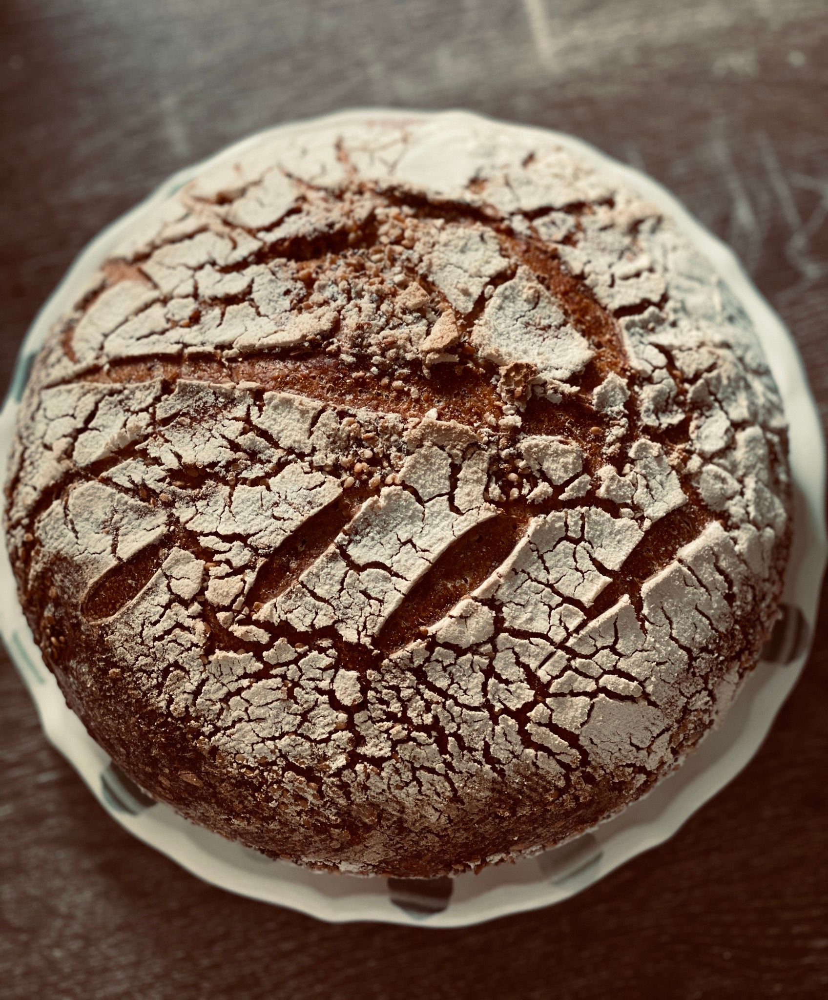
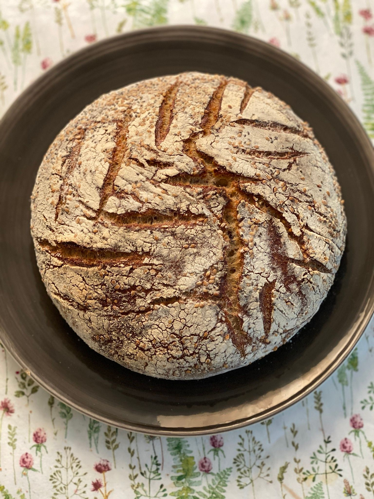
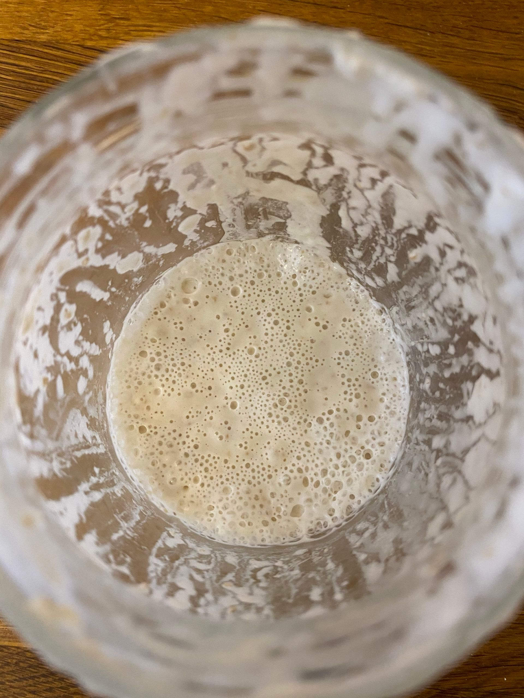

Son zamanlar məşhurlaşan turş mayalı çörək  əslində ən qədim və original çörək bişirmə növüdür. Axı bir zamanlar hazır maya yox idi və nənə-babalarımız yenə də çörək bişirirdilər. Bəs həqiqətən turş mayalı çörək deyildiyi kimi ən sağlam çörək növüdür? Həm mayamı hazırladım, həm çörəyimi bişirdim, həm də araşdırmalarımı edib bu postu yazmaq qərarına gəldim.

Turş maya (türkcə ekşi maya, ingiliscə sourdough) sadəcə su və undan hazırlanır. Su və un qarışdırılır, otaq temperaturunda və qaranlıq yerdə saxlanılıb, hər gün yenə də su və unla bəsləməklə fermentə edilir. Bir müddət sonra qabarcıqlar yaranır, xəfif turş qoxu gəlir və maya 2 dəfəyə qədər artır,bu zaman mayanın tutduğunu anlayırıq. Yəni, fermentasiya prosesi baş verir. Mayanın tutması 3 gündən-10 günədək müddətdə baş verir. Bu undan, saxlanılan yerin temperaturundan və s asılıdır. Eyni zamanda maya hazır olduqdan sonra çörək bişirilməsi, çörəyin xəmirinin gəlməsi də bildiyimiz hazır mayalarla hazırlanan çörəklərdən daha uzun müddətdə baş verir. Bu mayalanma prosesinin uzunluğunun bizə bir çox faydası olduğunu araşdırmalar göstərib. Bir çox araşdırmanın  keçidlərini də yerləşdirəcəm. Maraqlananlar daha ətraflı oxuya bilərlər.

Daha əvvəl Fitik asidlə (fitat) bağlı bir post paylaşmışdım. Bəzi fitik asidli bitkiləri sirkəli suda saxlamaqla fitik asidini azaldırdıq. Fitik asidin həm bizim orqanizmimizdə həzm olunması çətindir, həm də bitkinin tərkibində olan qidalı maddələrin də sorulmasını çətinləşdirir. Eyni maddə dənli bitkilərdə də olduğu üçün turş mayalı xəmirdə fitat miqdarı hazır mayalı xəmirə nisbətdə 25-50%-ə qədər azalır. Bu, turş mayalı xəmirin uzun müddətli fermentasiyası ilə bağlıdır.

[https://www.ncbi.nlm.nih.gov/pubmed/11368651](https://www.ncbi.nlm.nih.gov/pubmed/11368651)

[ncbi.nlm.nih.gov/pmc/articles/PMC3273010](ncbi.nlm.nih.gov/pmc/articles/PMC3273010)

Nəticədə turş mayalı çörəyin həzmi daha asan və qidalı maddələrin sorulması daha yüksək olur. Qidalı maddələrə folat, maqnezium və s.  kimi çox faydalı maddələr  daxildir.

Eyni zamanda bəzi araşdırmalar tuş mayanın tərkibindəki süd turşusunun uzun müddətli fermentasiyası nəticəsində antioksidantların miqdarını artırdığını göstərmişdir.

Həzmi asanlaşdırmasının digər səbəbi isə prebiotik və probiotiklərlə zəngin olmasıdır. Probiotik bizim həzm sistemimizdə olan və həzmə kömək edən yaxşı bakteriyalardır. Prebiotiklər isə probiotiklərin qidasıdır.

[https://www.ncbi.nlm.nih.gov/pubmed/19747602](https://www.ncbi.nlm.nih.gov/pubmed/19747602)

Son zamanlar hamımızın çox eşitdiyi gluteni də turş maya fermentasiyası azaldır. Gluten bəzi insanlarda heç bir problem yaratmasa da, bəzi insanlarda orta dərəcədə həzm problemləri, xəfif qaz, həzmsizlik və s yaratdığı kimi, bəzi insanlarda ağır problemlər yarada bilir. Glutenə qarşı ciddi intoleransı və allergiyası olan insanlar üçün yenə də tövsiyyə olunmasa da, orta və ya yüngül həssaslığı olanlar üçün əvəzedilməz tapıntı olacaq :) Turş maya gluteni 0-a endirməsə də böyük ölçüdə miqdarını azaldır.

[https://link.springer.com/article/10.1007/s00217-005-0220-x](https://link.springer.com/article/10.1007/s00217-005-0220-x)

Araşdırmalar hətta şəkər xəstələri üçün də ən faydalı növ çörək ola biləcəyini göstərmişdir. Turş mayalı çörək və hazır mayalı çörək yeyən 2 qrup insanın qan şəkərlərini ölçdükdə ilk qrup insanlarda qan şəkərinin digər qrupa nisbətdə daha aşağı olduğunu da göstərmişdir.

[https://www.ncbi.nlm.nih.gov/pubmed/17697425](https://www.ncbi.nlm.nih.gov/pubmed/17697425)

Nəticədə turş mayalı çörək təkcə dadı ilə deyil həm də faydaları ilə digər çörəkləri geridə qoyur. Çoxları hazırlanışının çətin olduğunu düşünsə də, mən çətin deyil də sadəcə  çox vaxt apardığını düşünürəm və əksinə bu prosesdən olduqca zövq alıram.

